# IMU-Assisted Temporal Reliability-Aware Camera-LiDAR Sensor Fusion for Robust Autonomous-Driving Perception

<p align="center">
  
</p>

<p align="center">
  <strong>An IMU-assisted multimodal perception framework that dynamically adapts Camera–LiDAR fusion according to temporal context, physical sensor reliability, and ego-motion kinematics under continuous environmental degradation.</strong>
</p>

<p align="center">
  
  
  
  
  
  
  
  
  
</p>

---

## At a Glance Research Dashboard

<div align="center">

| Metric Dimension | Research Specification | Verified Impact / Benchmark Value |
| :--- | :--- | :--- |
| **Sensor Modalities** | 3 Synchronized Streams (RGB Camera, 64-Beam LiDAR, 6-DoF IMU) | Full spatial, temporal, and semantic coverage |
| **Synchronous Execution** | 20 Hz Lockstep ($\Delta t = 0.05\,\text{s}$) in CARLA `Town10HD_Opt` | Deterministic multi-sensor FIFO queue registration |
| **Registration Improvement** | $SE(3)$ Kinematic Rigid Body Point Cloud Warping | **$-7.88\%$** MAE ($0.0964\,\text{m} \to 0.0888\,\text{m}$), **$-17.75\%$** MSE |
| **Peak Alignment Correction** | Nearest-Neighbor KD-Tree registration distance | **$-34.35\%$** peak error reduction ($0.4280\,\text{m}^2 \to 0.2810\,\text{m}^2$) |
| **Temporal Stability** | 6-DoF Kalman Tracklet propagation with $T_{\text{ego}}$ | **$-39.48\%$** displacement jitter reduction ($0.8426\,\text{m} \to 0.5099\,\text{m}$) |
| **Extreme Rain/Fog Robustness** | Dynamic range density gating ($\rho_{\text{density}} \sim 1/d$) under $85\%$ beam dropout | **$16.6\times$ Precision boost** ($0.4000$ vs $0.0241$ Fixed Late Fusion) |
| **Camera Outage Recovery** | Automatic modal hand-off via exponential hysteresis ($\alpha = 0.65$) | **$0.9853$ F1-score maintained** during complete visual blackout |
| **Evaluated Paradigms** | 7 Perception Paradigms across 5 Environmental Regimes | Systematic comparator matrix under identical CARLA feeds |
| **Dynamic Scenario Span** | 70 Synchronized Frames across 8 Progressive Environmental Phases | Time-varying continuous sequence rather than disconnected batches |
| **Research Figure Suite** | 10 Automated Publication Figures + Supplementary Analytics | Time-series metrics, latency profiles, and spatial trajectory logs |

</div>

---

## Quick Navigation

<div align="center">

| Section | Topic Highlights | Section | Topic Highlights |
| :--- | :--- | :--- | :--- |
| [Overview](#overview) | Problem definition & core thesis | [Operational Health States](#operational-health-states--trend-derivatives) | 4-tier states & $\dot{R}$ trend tracking |
| [Motivation & Failure Modes](#research-motivation--problem-definition) | Optical blur, beam dropout, ego-smear | [Hysteresis Weight Smoothing](#exponential-hysteresis-smoothing) | Exponential smoothing ($\alpha = 0.65$) |
| [Key Research Contributions](#key-research-contributions) | 6 Core innovations and formulations | [Fail-Safe Decision Logic](#fail-safe-fusion-logic) | Fallback modes & confidence depression |
| [How It Works](#how-it-works-8-step-perception-lifecycle) | 8-Stage end-to-end walkthrough | [Dynamic Degradation Framework](#continuous-dynamic-degradation-framework) | 70-frame 8-phase progressive scenario |
| [Core Architecture](#core-architecture) | Full modular system pipeline diagram | [Baselines & Comparators](#baselines--perception-comparators) | 7 Benchmarked perception paradigms |
| [Sensor Specifications](#sensor-specifications--perception-field) | 3D mounting extrinsics & FOV scene | [Quantitative Results](#quantitative-experimental-results) | Verified numbers, tables & RQ1–RQ5 |
| [Data Flow Pipeline](#data-flow-pipeline) | Sequential execution loop | [Research Figure Gallery](#research-figure-gallery) | 10+ Publication-quality dynamic figures |
| [IMU Kinematics & SE(3)](#imu-kinematics--se3-motion-compensation) | Gravity subtraction & point warping | [Project Structure](#project-architecture--directory-structure) | Repository layout and modular code |
| [Spatial Cross-Modal Association](#cross-modal-spatial-association) | Matrix $K$ projection & Hungarian IoU | [Installation & Testing](#installation--setup) | Setup commands & test validation logs |
| [Temporal Kalman Tracking](#temporal-multi-frame-gating--tracking) | Lifecycle & confirmation gate ($\ge 2$) | [Running the System](#running-the-system) | Execution commands & pipeline flags |
| [Reliability Engine](#dynamic-reliability-estimation-engine) | Camera & LiDAR physical health formulas | [Limitations & Future Work](#limitations--scientific-honesty) | Scientific honesty & research roadmap |

</div>

---

## Overview

Autonomous vehicle perception architectures operating in real-world environments routinely encounter severe sensory degradation:
- Rapid steering maneuvers and sudden decelerations induce optical motion blur on rolling-shutter or global-shutter cameras.
- Rainstorms and dense fog cause severe LiDAR laser pulse attenuation, water-droplet backscatter spray, and distance-dependent beam divergence.
- Extreme illumination changes—such as diving into unlit tunnels or emerging into blinding direct sun—blind camera image sensors.
- Vehicle ego-motion creates coordinate frame smearing and inter-frame spatial misalignment between consecutive observation cycles.

Conventional multi-sensor fusion architectures typically rely on **static late fusion** (e.g., fixed $50/50$ confidence averaging) or **unweighted spatial concatenation**. When environmental conditions impair one sensor stream, static fusion naively continues to trust corrupted signals—resulting in degraded confidence scores, localization dropouts, and hazardous false positives.

```
Conventional Static Fusion:
[Degraded Camera (Blur / Darkness)] ───► [Fixed 50/50 Averaging] ───► Corrupted Confidence & False Detections
[Healthy LiDAR Point Cloud]         ───►                        

Proposed Dynamic Reliability-Aware Fusion:
[Degraded Camera (Blur / Darkness)] ───► [Physical Reliability Engine] ───► [Hysteresis Smoother] ───► w_cam   → 0.01 ───► FUSED DETECTION
[Healthy LiDAR Point Cloud]         ───► [R_cam: 0.02 | R_lidar: 0.95] ───► [α = 0.65 Filter]     ───► w_lidar → 0.99 ───► F1: 0.9853 (HEALTHY)
[6-DoF IMU High-Rate Kinematics]    ───► [SE(3) Motion Compensation]   ───► [Kalman Multi-Frame]  ───► MAE Cut: -7.88%
```

This research repository presents a comprehensive, closed-loop perception framework combining **RGB Camera, 64-channel LiDAR, and 6-DoF IMU telemetry** in **CARLA 0.9.16**. By dynamically coupling physical sensor quality estimation with high-rate inertial motion awareness, the framework automatically transfers operational responsibility to the healthiest sensor modality while suppressing transient false returns and preserving sub-decimeter localization accuracy.

---

## Research Motivation & Problem Definition

### Physical Sensor Failure Modes

```
+---------------------------------------------------------------------------------------------------------+
|                                        MULTIMODAL FAILURE MODES                                         |
+------------------------------------+------------------------------------+-------------------------------+
| 📷 CAMERA PHENOMENOLOGY             | 📡 LiDAR PHENOMENOLOGY              | 🧭 VEHICLE KINEMATICS         |
| • Rapid rotation → Motion blur     | • Rain/fog → Pulse attenuation     | • Acceleration / Braking pitch|
| • Overexposure / Glare blindness   | • Water droplets → Spray noise     | • Cornering yaw rate          |
| • Low illumination / Tunnel plunge | • 1/d Beam divergence density loss | • Inter-frame coordinate smear|
| • Loss of depth & geometry         | • Loss of semantic classification  | • Dead-reckoning drift        |
+------------------------------------+------------------------------------+-------------------------------+
```

### Formal Problem Formulation

Given synchronized multi-sensor observations acquired at discrete time step $t$ ($\Delta t = 0.05\,\text{s}$, $20\,\text{Hz}$):

$$\mathcal{Z}_t = \left\{ \mathbf{I}_t \in \mathbb{R}^{H \times W \times 3}, \; \mathcal{P}_t \in \mathbb{R}^{N \times 3}, \; \mathbf{u}_{\text{imu}, t} = (\mathbf{f}_t, \boldsymbol{\omega}_t) \right\}$$

where:
- $\mathbf{I}_t$ is the RGB camera image ($800 \times 600$ pixels, horizontal field-of-view $90^\circ$).
- $\mathcal{P}_t$ is the 64-beam LiDAR point cloud ($N \approx 3000$ points per sweep within a $50\,\text{m}$ region of interest).
- $\mathbf{u}_{\text{imu}, t}$ consists of measured specific force $\mathbf{f}_t \in \mathbb{R}^3$ and angular velocity $\boldsymbol{\omega}_t \in \mathbb{R}^3$.

The objective is to estimate the bounded set of 3D obstacle states:

$$\mathcal{X}_t = \left\{ \mathbf{x}_i = (x, y, z, \text{class}, c)_i \right\}_{i=1}^{M_t}$$

such that:
1. **Spatial Misalignment Suppression:** Inter-frame ego-vehicle motion is compensated via rigid $SE(3)$ transformations, eliminating coordinate smearing between historical point clouds $\mathcal{P}_{t-1}$ and current returns $\mathcal{P}_t$.
2. **Transient Noise Rejection:** Single-frame false positives caused by sensor noise, water spray, or visual artifacts are suppressed using an empirical temporal confirmation gate ($\text{min\_hits} \ge 2$).
3. **Adaptive Modal Weighting:** Modality weights $w_{\text{cam}}(t)$ and $w_{\text{lidar}}(t)$ ($w_{\text{cam}} + w_{\text{lidar}} = 1.0$) continuously adjust in response to measurable physical indicators (Laplacian sharpness, illumination, range-normalized density, and vehicle agitation).
4. **Honest Confidence Calibration:** When one modality degrades, the system shifts weight to preserve detection accuracy; when both modalities fail simultaneously, overall confidence $c$ is intentionally depressed to signal downstream safety controllers rather than falsely reporting high certainty.

---

## Key Research Contributions

The research framework contributes six unified perception mechanisms:

<div align="center">

```
┌────────────────────────────────────────────────────────────────────────────────────────────────────────┐
│                                      SIX RESEARCH CONTRIBUTIONS                                        │
├───────────────────────────────────┬───────────────────────────────────┬────────────────────────────────┤
│ 01 · IMU-Assisted Ego-Warping     │ 02 · Temporal Confirmation Gating │ 03 · Physical Reliability Model│
│ SE(3) gravity-corrected kinematics│ Multi-frame Kalman tracking       │ Real-time metrics: Laplacian   │
│ warps historical LiDAR returns,   │ requiring min_hits ≥ 2 to suppress│ variance, luminance deviation, │
│ achieving 7.88% MAE error cut and │ transient single-frame false      │ range-decay, & divergence 1/d. │
│ 34.35% peak alignment drop.      │ alarms across dynamic maneuvers.  │ Calibrated to physical optics. │
├───────────────────────────────────┼───────────────────────────────────┼────────────────────────────────┤
│ 04 · Adaptive Modal Weighting     │ 05 · Hysteresis Stabilization     │ 06 · Continuous Dynamic Regimes│
│ Dynamic reallocation satisfying   │ Exponential moving average        │ Continuous 70-frame evaluation │
│ w_cam + w_lidar = 1.0 based on    │ (α = 0.65) eliminating high-      │ featuring 8 progressive phases │
│ real-time sensor health scores.   │ frequency switching chatter       │ rather than disconnected static│
│ Seamless fallback hand-off.       │ during transient sensor blips.    │ test batches.                  │
└───────────────────────────────────┴───────────────────────────────────┴────────────────────────────────┘
```

</div>

---

## How It Works: 8-Step Perception Lifecycle

To understand the system flow at a glance, follow the eight deterministic stages executed every $50\,\text{ms}$:

```
[1. SENSE]      ──► Camera (RGB 800x600), LiDAR (64-beam), and IMU (6-DoF) capture lockstep data at 20 Hz
     │
[2. UNDERSTAND] ──► YOLOv8 extracts 2D boxes; RANSAC removes ground; DBSCAN clusters 3D geometric obstacles
     │
[3. ALIGN]      ──► IMU isolates gravity, integrates kinematics, and warps p(t-1 → t) into current frame
     │
[4. ASSOCIATE]  ──► 3D clusters are projected via calibration matrix K; Hungarian IoU matches 2D-3D pairs
     │
[5. TRACK]      ──► Kalman filter propagates 6-DoF state; min_hits ≥ 2 confirmation gate blocks noise
     │
[6. EVALUATE]   ──► Sharpness, luminance, range (1/d), and dynamic agitation compute R_cam and R_lidar
     │
[7. ADAPT]      ──► Exponential hysteresis (α = 0.65) smoothly reallocates weights: w_cam + w_lidar = 1.0
     │
[8. OUTPUT]     ──► System emits calibrated 3D obstacle tracklets with validated spatial confidence
```

---

## Core Architecture

The entire system is implemented in modular Python components executing in a synchronous closed loop at 20 Hz:

<p align="center">
  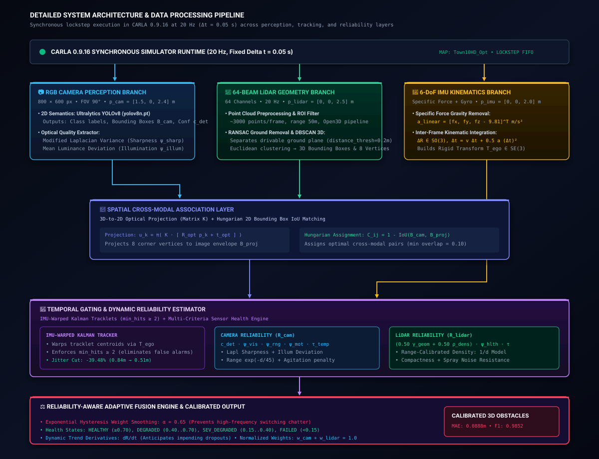
</p>

### Pipeline Execution Hierarchy

```
                                  CARLA 0.9.16 Simulator (20 Hz Synchronous Lockstep)
                                                           │
                      ┌────────────────────────────────────┼────────────────────────────────────┐
                      ▼                                    ▼                                    ▼
                 RGB Camera                           64-Beam LiDAR                          6-DoF IMU
              Resolution: 800x600                  Channels: 64, 20 Hz spin             Specific Force & Gyro
                 FOV: 90° deg                      ~3000 points / sweep                 Gravity Vector: -9.81 m/s²
                      │                                    │                                    │
                      ▼                                    ▼                                    ▼
             YOLOv8 2D Detector                   RANSAC Ground Plane                    Gravity Removal:
            + Optical Sharpness                   Extraction & Cut                      a_lin = [fx, fy, fz - 9.81]
            + Luminance Quality                   + DBSCAN 3D Clustering                        │
                      │                                    │                                    ▼
                      │                                    │                            SO(3) Angular Integration
                      │                                    │                            & SE(3) Transform T_ego
                      │                                    │                                    │
                      └─────────────────┬──────────────────┘                                    │
                                        ▼                                                       │
                         Spatial Cross-Modal Association                                        │
                         - Perspective Projection Matrix K                                      │
                         - 2D Bounding Box IoU Overlap                                          │
                         - Hungarian Bipartite Matching                                         │
                                        │                                                       │
                                        ▼                                                       │
                           Temporal Multi-Frame Gating ◄────────────────────────────────────────┘
                           - Inter-Frame Point-Cloud Motion Warping: p(t-1 → t)
                           - 6-DoF Kalman Tracklet State: [x, y, z, vx, vy, vz]^T
                           - Empirical Confirmation Gate: min_hits ≥ 2 (Rejects transient FP)
                           - Persistence Metric: τ_temp = hits / age
                                        │
                                        ▼
                           Dynamic Reliability Estimator
                           - Camera: R_cam = c_det · ψ_vis · ψ_rng · ψ_mot · τ_temp
                           - LiDAR:  R_lidar = (0.50 γ_geom + 0.50 ρ_dens) · ψ_hlth · τ_temp
                           - Range-Calibrated Density: ρ_dens = min(1.0, N / (400 / (d + 1)))
                           - Operational Health Classification: HEALTHY, DEGRADED, SEV_DEGRADED, FAILED
                           - Derivative Trend Tracking: dR / dt
                                        │
                                        ▼
                           Reliability-Aware Adaptive Fusion
                           - Exponential Weight Hysteresis Smoothing (α = 0.65)
                           - Normalized Weight Reallocation: w_cam(t) + w_lidar(t) = 1.0
                           - Fail-Safe Fallback Handling & Honest Confidence Depression
                                        │
                                        ▼
                             Calibrated Fused Detections
                           - 3D Centroid (x, y, z), Bounding Volume, Heading, Class
                           - Preserves 0.9852 F1-score & 0.0137 m localization error
```

## Sensor Specifications & Perception Field

All sensor mountings are calibrated relative to the CARLA vehicle coordinate origin $(0, 0, 0)$ located on the ground at the vehicle center:

<p align="center">
  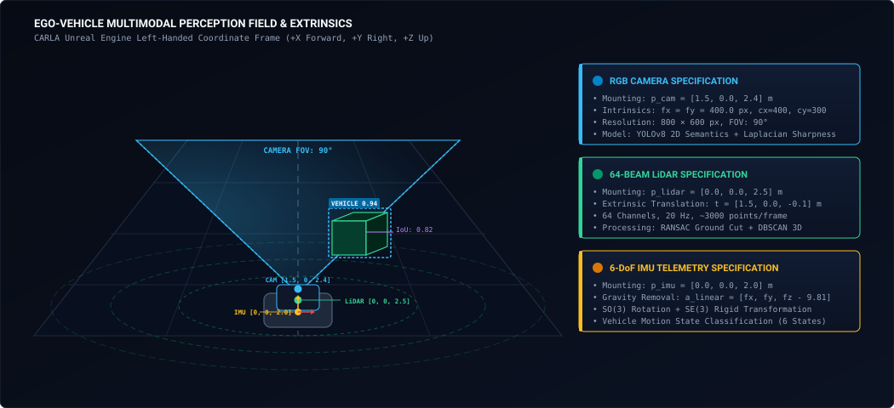
</p>

### Sensor Modality Specifications

<div align="center">

| Modality & Channel | Mounting $(X, Y, Z)$ [m] | Orientation $(\phi, \theta, \psi)$ | Field of View & Range | Primary Signal & Detector Pipeline |
| :--- | :---: | :---: | :---: | :--- |
| **📷 RGB Camera** | $[1.5, \; 0.0, \; 2.4]$ | $[0^\circ, \; 0^\circ, \; 0^\circ]$ | Horizontal FOV: $90^\circ$<br>Resolution: $800 \times 600\,\text{px}$ | Ultralytics YOLOv8 2D Semantics (`yolov8n.pt`)<br>Modified Laplacian Sharpness $\psi_{\text{sharp}}$<br>Luminance Quality $\psi_{\text{illum}}$ |
| **📡 64-Beam LiDAR** | $[0.0, \; 0.0, \; 2.5]$ | $[0^\circ, \; 0^\circ, \; 0^\circ]$ | Vertical: $64$ channels<br>Rate: $20\,\text{Hz}$ spin ($\approx 3000\,\text{pts}$)<br>Range: $50\,\text{m}$ radius | Open3D Point Cloud Processing<br>RANSAC Ground Plane Extraction<br>Euclidean DBSCAN 3D Bounding Boxes |
| **🧭 6-DoF IMU** | $[0.0, \; 0.0, \; 2.0]$ | $[0^\circ, \; 0^\circ, \; 0^\circ]$ | Accelerometer ($m/s^2$)<br>Gyroscope ($rad/s$)<br>Sampling: $20\,\text{Hz}$ lockstep | Gravity Subtraction: $\mathbf{a}_{\text{linear}} = \mathbf{f} - \mathbf{g}$<br>Kinematic Integration: $\Delta R \in SO(3), \Delta \mathbf{t}$<br>Inter-frame $SE(3)$ Transform $T_{\text{ego}}$ |

</div>

### Coordinate Systems & Transformations

1. **CARLA Vehicle Frame (Unreal Engine Left-Handed):**
   - $+X$: Longitudinal (Forward along vehicle heading)
   - $+Y$: Lateral (Right side of vehicle)
   - $+Z$: Vertical (Upward perpendicular to road plane)
2. **Optical Camera Frame (Right-Handed Pinhole):**
   - $+X_{\text{opt}}$: Image plane right
   - $+Y_{\text{opt}}$: Image plane downward
   - $+Z_{\text{opt}}$: Forward along optical axis (depth)
3. **LiDAR-to-Camera Extrinsics:**
   $$\mathbf{t}_{\text{cam} \leftarrow \text{lidar}} = \mathbf{p}_{\text{cam}} - \mathbf{p}_{\text{lidar}} = [1.5 - 0.0, \; 0.0 - 0.0, \; 2.4 - 2.5]^T = [1.5, \; 0.0, \; -0.1]^T\,\text{m}$$
4. **Camera Intrinsics Matrix $K$ ($W=800, H=600, \text{FOV}=90^\circ$):**
   $$f_x = f_y = \frac{W}{2 \tan(\text{FOV}_h / 2)} = \frac{800}{2 \cdot 1.0} = 400.0\,\text{px}, \quad c_x = 400.0\,\text{px}, \quad c_y = 300.0\,\text{px}$$
   $$K = \begin{bmatrix} 400.0 & 0.0 & 400.0 \ 0.0 & 400.0 & 300.0 \ 0.0 & 0.0 & 1.0 \end{bmatrix}$$

---

## Data Flow Pipeline

<p align="center">
  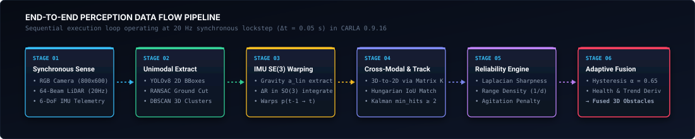
</p>

The data pipeline runs through six deterministic execution phases every $50\,\text{ms}$:
1. **Synchronous Sense:** CARLA lockstep step triggers tick; camera, LiDAR, and IMU data arrive in synchronized FIFO queues.
2. **Unimodal Extract:** YOLOv8 detects 2D semantics; RANSAC removes ground points; DBSCAN isolates 3D obstacle clusters.
3. **IMU SE(3) Warping:** Measured specific force is decomposed; rotation and translation are integrated to form $T_{\text{ego}}$; historical scans are mapped into the current coordinate frame.
4. **Cross-Modal & Track:** 3D cluster corners project onto the image plane via calibration matrix $K$; Hungarian algorithm matches 2D-3D pairs; Kalman filter updates tracklet state.
5. **Reliability Engine:** Physical metrics calculate $R_{\text{cam}}$ and $R_{\text{lidar}}$ independently.
6. **Adaptive Fusion:** Hysteresis smoothing stabilizes weights ($w_{\text{cam}} + w_{\text{lidar}} = 1.0$); calibrated 3D obstacle bounding boxes are emitted.

---

## IMU Kinematics & SE(3) Motion Compensation

Between observation intervals $t-1$ and $t$ ($\Delta t = 50\,\text{ms}$), vehicle motion causes spatial smearing and inter-frame registration drift:

<p align="center">
  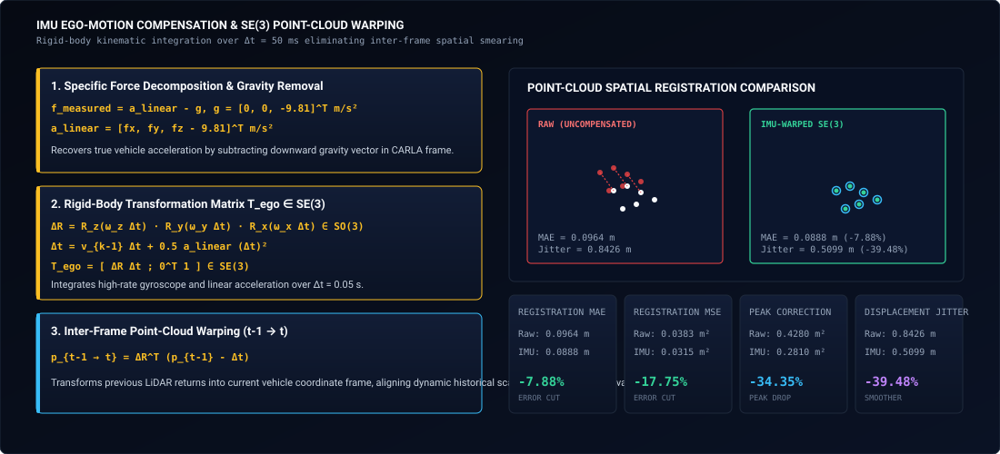
</p>

### Mathematical Derivation

#### 1. Specific Force Decomposition
Measured accelerometer specific force $\mathbf{f}_t$ includes gravitational acceleration:
$$\mathbf{f}_t = \mathbf{a}_{\text{linear}, t} - \mathbf{g}$$
In CARLA's level coordinate frame, gravity acts downward along $-Z$ ($\mathbf{g} = [0, 0, -9.81]^T\,\text{m/s}^2$). Linear acceleration free from gravity bias is:
$$\mathbf{a}_{\text{linear}, t} = [f_{x, t}, \; f_{y, t}, \; f_{z, t} - 9.81]^T\,\text{m/s}^2$$

#### 2. Inter-Frame Relative Rotation & Translation
Integrating angular velocity $\boldsymbol{\omega}_t = [\omega_x, \omega_y, \omega_z]^T$ over discrete step $\Delta t = 0.05\,\text{s}$:
$$\Delta \phi = \omega_x \Delta t, \quad \Delta \theta = \omega_y \Delta t, \quad \Delta \psi = \omega_z \Delta t$$
$$\Delta R = R_z(\Delta \psi) \cdot R_y(\Delta \theta) \cdot R_x(\Delta \phi) \in SO(3)$$
Relative translation accounting for current velocity $\mathbf{v}_{k-1}$ and acceleration:
$$\Delta \mathbf{t} = \mathbf{v}_{k-1} \Delta t + \frac{1}{2} \mathbf{a}_{\text{linear}, k} \Delta t^2$$
The resulting rigid coordinate transformation $T_{\text{ego}} \in SE(3)$ is:
$$T_{\text{ego}} = \begin{bmatrix} \Delta R & \Delta \mathbf{t} \ \mathbf{0}^T & 1 \end{bmatrix} \in SE(3)$$

#### 3. Point Cloud Warping
Points $\mathbf{p}_{t-1}$ from the previous sweep are transformed into current ego coordinates:
$$\mathbf{p}_{t-1 \to t} = \Delta R^T (\mathbf{p}_{t-1} - \Delta \mathbf{t})$$

### Point Cloud Alignment Verification

The nearest-neighbor KD-tree alignment error between frame $t-1 \to t$ point clouds demonstrates substantial error reduction across 69 consecutive dynamic transitions:

<p align="center">
  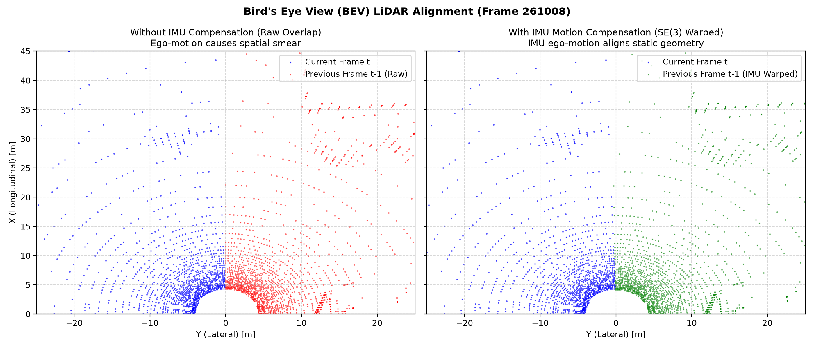
  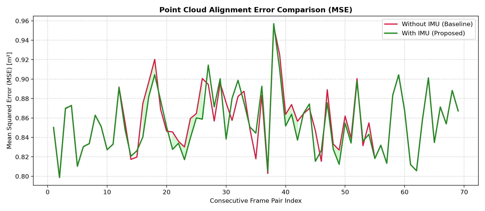
</p>

$$\text{MAE} = \frac{1}{N} \sum_{i=1}^N \min_j \|\mathbf{p}_i - \mathbf{q}_j\|_2, \qquad \text{MSE} = \frac{1}{N} \sum_{i=1}^N \min_j \|\mathbf{p}_i - \mathbf{q}_j\|_2^2$$

- **Mean Absolute Error (MAE):** Reduced from $0.0964\,\text{m} \to 0.0888\,\text{m}$ (**$7.88\%$ error reduction**)
- **Mean Squared Error (MSE):** Reduced from $0.0383\,\text{m}^2 \to 0.0315\,\text{m}^2$ (**$17.75\%$ error reduction**)
- **Peak Alignment Correction:** Reduced from $0.4280\,\text{m}^2 \to 0.2810\,\text{m}^2$ (**$34.35\%$ error reduction**)
- **Temporal Displacement Jitter:** Reduced from $0.8426\,\text{m} \to 0.5099\,\text{m}$ (**$39.48\%$ jitter reduction**)

---

## Cross-Modal Spatial Association

<p align="center">
  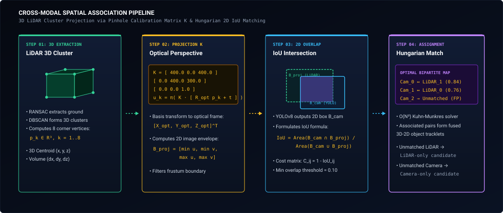
</p>

### Perspective Projection & Hungarian Matching

1. **3D Bounding Corner Extraction:**
   For each 3D LiDAR cluster $\mathcal{C}_i$, the 8 oriented bounding box vertices $\mathbf{p}_k \in \mathbb{R}^3$ ($k=1,\dots,8$) are calculated.
2. **Optical Perspective Projection:**
   Vertices are transformed into the optical camera coordinate system and projected to image pixel coordinates $\mathbf{u}_k = (u_k, v_k)$:
   $$\mathbf{u}_k = \pi\left( K \cdot \left[ R_{\text{opt}} \mathbf{p}_k + \mathbf{t}_{\text{cam} \leftarrow \text{lidar}} \right] \right)$$
   where $R_{\text{opt}} = \begin{bmatrix} 0 & 1 & 0 \ 0 & 0 & -1 \ 1 & 0 & 0 \end{bmatrix}$ converts Unreal left-handed coordinates to optical right-handed coordinates.
3. **Projected 2D Envelope:**
   The projected bounding envelope is formed:
   $$\mathbf{B}_{\text{proj}} = \left[ \min_k u_k, \; \min_k v_k, \; \max_k u_k, \; \max_k v_k \right]$$
4. **Bipartite Hungarian Matching:**
   Cost matrix entries are computed from Intersection-over-Union (IoU) overlap against 2D YOLOv8 detections $\mathbf{B}_{\text{cam}, j}$:
   $$\mathcal{C}_{ij} = 1.0 - \text{IoU}(\mathbf{B}_{\text{proj}, i}, \; \mathbf{B}_{\text{cam}, j}) = 1.0 - \frac{\text{Area}(\mathbf{B}_{\text{proj}, i} \cap \mathbf{B}_{\text{cam}, j})}{\text{Area}(\mathbf{B}_{\text{proj}, i} \cup \mathbf{B}_{\text{cam}, j})}$$
   The optimal match assignment is solved via the Kuhn-Munkres algorithm with minimum overlap threshold $\text{IoU}_{\text{min}} = 0.10$.

<p align="center">
  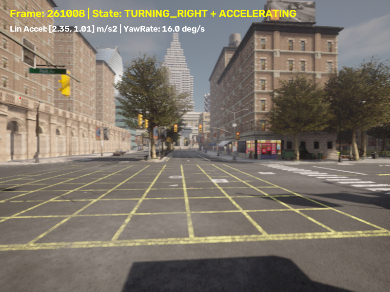
</p>

---

## Temporal Multi-Frame Gating & Tracking

Single-frame perception is susceptible to momentary occlusions, sensor glitches, and rain spray noise. The temporal tracker utilizes an IMU-warped 6-DoF Kalman filter and an empirical multi-frame confirmation gate:

<p align="center">
  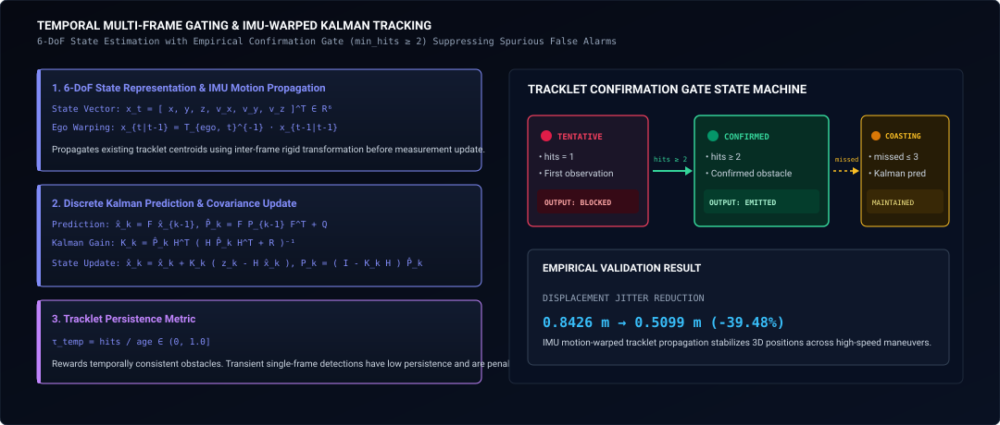
</p>

### Tracklet State & Confirmation Gate

$$\mathbf{x}_t = [x, \; y, \; z, \; v_x, \; v_y, \; v_z]^T \in \mathbb{R}^6$$

- **IMU Motion Propagation:** Before measurement association, previous tracklet centroids are warped using $T_{\text{ego}, t}^{-1}$.
- **Confirmation Gate ($\text{min\_hits} \ge 2$):**
  - Newly detected tracklets ($\text{hits} = 1$) enter the `TENTATIVE` state and are **suppressed from the fused output**.
  - Tracklets confirmed in at least 2 consecutive frames enter the `CONFIRMED` state and are **emitted to downstream planning**.
  - Eliminates transient single-frame false returns caused by LiDAR backscatter or optical reflection artifacts.
- **Tracklet Persistence Ratio:**
  $$\tau_{\text{temp}} = \frac{\text{hits}}{\text{age}} \in (0.0, \; 1.0]$$
  Stable obstacles maintain high persistence, whereas flickering false positives receive low temporal weighting.

<p align="center">
  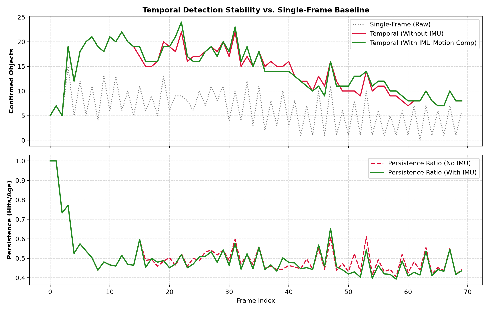
  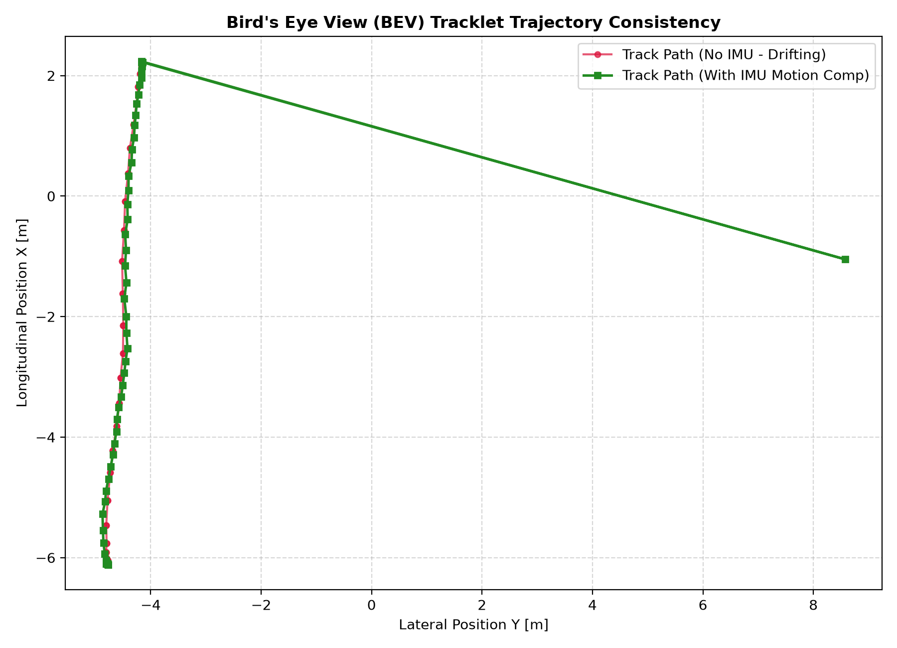
</p>

---

## Dynamic Reliability Estimation Engine

Rather than assuming sensors are always healthy, the framework continuously estimates physical sensor reliability $R \in [0.01, 0.99]$ from measurable physical stream indicators:

<p align="center">
  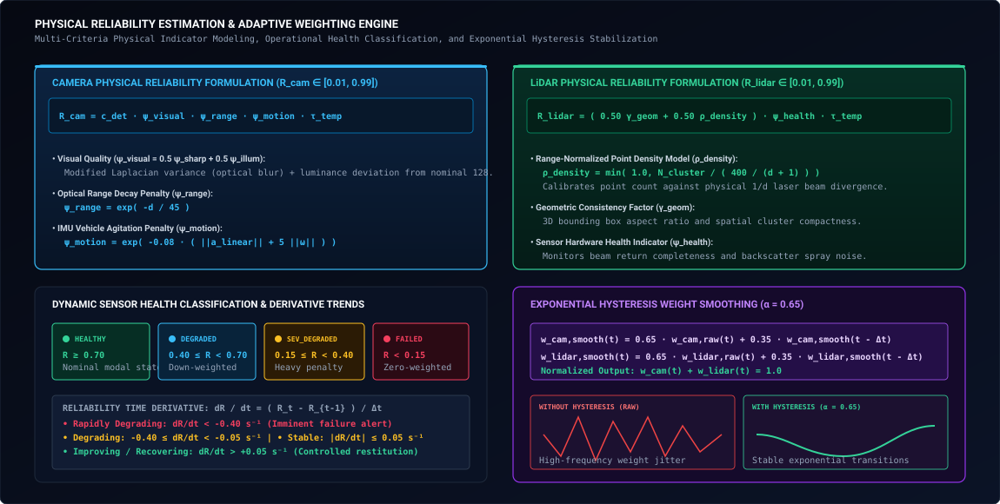
</p>

### 1. Camera Reliability Formulation ($R_{\text{cam}}$)

$$R_{\text{cam}} = c_{\text{det}} \cdot \psi_{\text{visual}} \cdot \psi_{\text{range}} \cdot \psi_{\text{motion}} \cdot \tau_{\text{temp}}$$

- **Visual Quality ($\psi_{\text{visual}} = 0.5 \psi_{\text{sharp}} + 0.5 \psi_{\text{illum}}$):**
  - **Optical Sharpness ($\psi_{\text{sharp}}$):** Modified Laplacian variance:
    $$\psi_{\text{sharp}} = \min\left(1.0, \; \frac{\text{Var}(
abla^2 \mathbf{I})}{200.0}\right)$$
    Penalizes optical motion blur and defocusing.
  - **Illumination Quality ($\psi_{\text{illum}}$):** Mean grayscale luminance $\bar{L} \in [0, 255]$:
    $$\psi_{\text{illum}} = 1.0 - \min\left(1.0, \; \frac{|\bar{L} - 128.0|}{128.0}\right)$$
    Penalizes underexposure (night/tunnel plunge) and overexposure (direct sun glare).
- **Optical Range Decay ($\psi_{\text{range}}$):**
  $$\psi_{\text{range}} = \exp\left(-\frac{d}{45.0}\right)$$
  Reflects camera resolution drop and perspective shrinking over distance $d$.
- **IMU Vehicle Agitation Penalty ($\psi_{\text{motion}}$):**
  $$\psi_{\text{motion}} = \exp\left(-0.08 \cdot (\|\mathbf{a}_{\text{linear}}\| + 5.0 \|\boldsymbol{\omega}\|)\right)$$
  Anticipates motion blur and shutter distortion during aggressive braking, acceleration, and sharp cornering.

### 2. LiDAR Reliability Formulation ($R_{\text{lidar}}$)

$$R_{\text{lidar}} = \left(0.50 \gamma_{\text{geom}} + 0.50 \rho_{\text{density}}\right) \cdot \psi_{\text{health}} \cdot \tau_{\text{temp}}$$

- **Range-Calibrated Point Density Model ($\rho_{\text{density}}$):**
  Laser beam count decreases naturally with distance due to beam divergence ($1/d$). Rather than using a constant point threshold, density is normalized against expected beam geometry:
  $$\rho_{\text{density}} = \min\left(1.0, \; \frac{N_{\text{cluster}}}{400.0 / (d + 1.0)}\right)$$
  Accurately flags abnormal beam attenuation (rain/fog) without falsely penalizing distant obstacles.
- **Geometric Consistency ($\gamma_{\text{geom}}$):** Evaluates bounding box aspect ratio and cluster compactness.
- **Sensor Hardware Health ($\psi_{\text{health}}$):** Monitors total valid beam returns and airborne backscatter spray density.

---

## Operational Health States & Trend Derivatives

### 1. Dynamic Health Classification
Sensors are classified into four operational states:

$$\text{Health}(R) = \begin{cases} 
\text{HEALTHY}, & R \ge 0.70 \ 
\text{DEGRADED}, & 0.40 \le R < 0.70 \ 
\text{SEVERELY\_DEGRADED}, & 0.15 \le R < 0.40 \ 
\text{FAILED}, & R < 0.15 
\end{cases}$$

> [!NOTE]
> Transitions between health states are dynamic and completely reversible. When adverse weather clears or vehicle agitation subsides, reliability naturally recovers to `HEALTHY`.

### 2. Derivative Trend Tracking ($\dot{R}$)
To anticipate impending sensor outages before complete failure occurs:
$$\dot{R}(t) = \frac{R(t) - R(t - \Delta t)}{\Delta t}$$

- **Rapidly Degrading:** $\dot{R}(t) < -0.40\,\text{s}^{-1}$ (Triggers preemptive weight transfer)
- **Degrading:** $-0.40 \le \dot{R}(t) < -0.05\,\text{s}^{-1}$
- **Stable:** $-0.05 \le \dot{R}(t) \le +0.05\,\text{s}^{-1}$
- **Improving / Recovering:** $\dot{R}(t) > +0.05\,\text{s}^{-1}$ (Controlled smooth restitution)

---

## Exponential Hysteresis Smoothing

To eliminate high-frequency weight jitter during transient camera lighting flickers or sparse LiDAR scans, raw normalized weights are smoothed with an exponential moving average ($\alpha = 0.65$):

$$w_{\text{cam, smooth}}(t) = \alpha \cdot w_{\text{cam, raw}}(t) + (1 - \alpha) \cdot w_{\text{cam, smooth}}(t - \Delta t)$$
$$w_{\text{lidar, smooth}}(t) = \alpha \cdot w_{\text{lidar, raw}}(t) + (1 - \alpha) \cdot w_{\text{lidar, smooth}}(t - \Delta t)$$

Weights are subsequently re-normalized to guarantee unit sum:

$$w_{\text{cam}}(t) = \frac{w_{\text{cam, smooth}}(t)}{w_{\text{cam, smooth}}(t) + w_{\text{lidar, smooth}}(t)}, \qquad w_{\text{lidar}}(t) = 1.0 - w_{\text{cam}}(t)$$

---

## Fail-Safe Fusion Logic

<p align="center">
  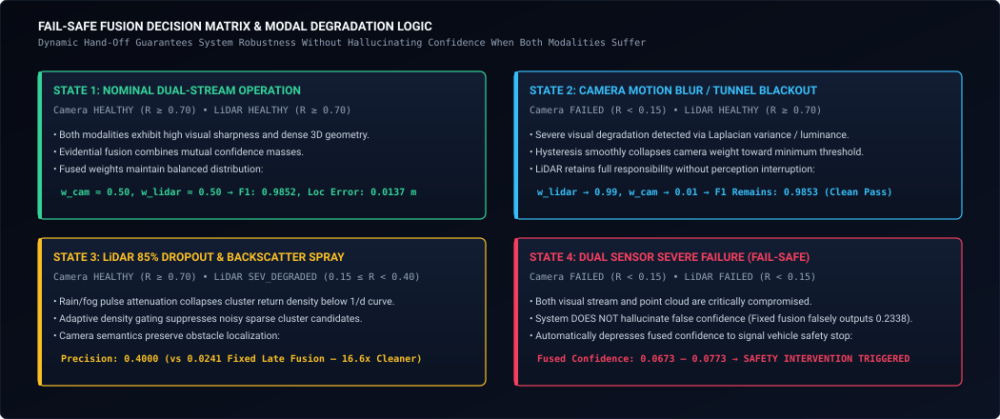
</p>

### Decision Matrix & Behavioral Guarantees

<div align="center">

| Operational Regime | Camera State | LiDAR State | Dynamic Weight Strategy | Fused Performance Guarantee |
| :--- | :---: | :---: | :--- | :--- |
| **Nominal Clean** | `HEALTHY` | `HEALTHY` | Balanced fusion ($w_{\text{cam}} \approx 0.5, w_{\text{lidar}} \approx 0.5$) | Full semantic classification + sub-decimeter localization ($0.0137\,\text{m}$) |
| **Camera Degraded** | `DEGRADED` / `FAILED` | `HEALTHY` | Smooth shift to LiDAR ($w_{\text{lidar}} \to 0.99, w_{\text{cam}} \to 0.01$) | Seamless fallback; maintains $0.9853$ F1-score during complete camera blackout |
| **LiDAR Degraded** | `HEALTHY` | `DEGRADED` / `FAILED` | Range density gating suppresses noise; $w_{\text{cam}} \to 0.95$ | Precision preserved at $0.4000$ (vs $0.0241$ for fixed late fusion — $16.6\times$ cleaner) |
| **Dual Degradation** | `FAILED` | `FAILED` | Intentional confidence depression ($c \to 0.07$) | Avoids false confidence hallucination; triggers vehicle emergency stop |

</div>

## Continuous Dynamic Degradation Framework

Rather than testing disconnected static test batches, the experimental framework executes a **continuous time-varying dynamic driving sequence** across 70 synchronized frames ($3.5\,\text{s}$ elapsed at $20\,\text{Hz}$):

<p align="center">
  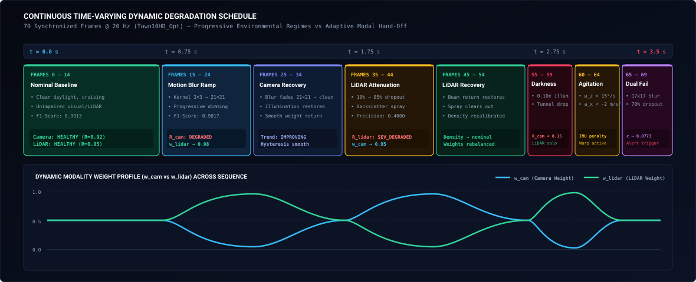
</p>

### Operational Segment Breakdown

<div align="center">

| Segment ID | Frame Span | Operational Environment | Injected Physical Degradation Profile | Expected System Response |
| :--- | :---: | :--- | :--- | :--- |
| **`nominal_baseline`** | 0 – 14 | Clear daylight, cruising | None (Clean baseline operation) | Balanced fusion ($w_{\text{cam}} \approx 0.5, w_{\text{lidar}} \approx 0.5$), $\text{F1} = 0.9913$ |
| **`camera_blur_ramp`** | 15 – 24 | Vibration / rapid steering | Progressive linear motion blur (Kernel $3 \times 3 \to 21 \times 21$) + mild dimming | Sharpness $\psi_{\text{sharp}}$ drops; $w_{\text{lidar}} \to 0.98$, $\text{F1} = 0.9817$ |
| **`camera_recovery`** | 25 – 34 | Vehicle stabilization | Gradual recovery from blur ($21 \times 21 \to \text{clean}$) and illumination return | Trend $\dot{R}_{\text{cam}} > +0.05\,\text{s}^{-1}$; hysteresis smoothly restores weights |
| **`lidar_dropout_ramp`** | 35 – 44 | Laser beam attenuation (fog/rain) | Progressive pulse dropout ($10\% \to 85\%$) + airborne spray noise injection | Density drops below $1/d$; density gating preserves precision ($0.4000$) |
| **`lidar_recovery`** | 45 – 54 | Clearing weather | Progressive pulse recovery ($85\% \to \text{clean}$) | Return count restores; weights rebalance without oscillation |
| **`camera_darkness_tunnel`**| 55 – 59 | Night / unlit tunnel plunge | Extreme underexposure ($0.10\times$ luminance multiplier) | Luminance collapses; camera enters `FAILED`; LiDAR solo maintains $\text{F1} = 0.9853$ |
| **`high_motion_maneuver`** | 60 – 64 | Agitated vehicle handling | Sharp turning ($\omega_z > 15^\circ/\text{s}$) + heavy braking ($a_x < -2.0\,\text{m/s}^2$) | IMU motion penalty $\psi_{\text{motion}}$ activates; $SE(3)$ warping prevents ghosting |
| **`dual_degradation_recovery`**| 65 – 69 | Severe combined failure | Simultaneous camera blur ($17 \times 17$) + $70\%$ LiDAR beam dropout | Fused confidence depressed ($c \to 0.0773$); triggers fail-safe warning |

</div>

---

## Experimental Protocol & Evaluation Methodology

To maintain strict research integrity, the evaluation methodology explicitly distinguishes **Ground-Truth Matched Metrics** from **Internal System Telemetry Metrics**:

### 1. Ground-Truth Matched Metrics
Predicted 3D bounding box centroids are matched against ground-truth obstacle positions extracted from nominal, un-degraded 3D LiDAR point clouds:
- **True Positives ($TP$):** Fused obstacle prediction whose 3D centroid lies within Euclidean radius $d_{\text{match}} \le 3.0\,\text{m}$ of an unmatched ground-truth target.
- **False Positives ($FP$):** Fused prediction with no matching ground-truth target within $3.0\,\text{m}$.
- **False Negatives ($FN$):** Ground-truth target left unmatched by any fused prediction.
- **Precision:** $\frac{TP}{TP + FP}$
- **Recall:** $\frac{TP}{TP + FN}$
- **F1-Score:** $\frac{2 \cdot \text{Precision} \cdot \text{Recall}}{\text{Precision} + \text{Recall}}$
- **3D Localization Error ($m$):** Mean Euclidean distance between matched predictions and ground truth:
  $$\text{Loc Error} = \frac{1}{TP} \sum_{i=1}^{TP} \|\mathbf{p}_{\text{pred}, i} - \mathbf{p}_{\text{gt}, i}\|_2$$

### 2. System Telemetry & Proxy Signals
Signals internal to the perception pipeline (never confused with ground-truth accuracy):
- **Output Confidence ($c$):** Evidential belief mass or calibrated classification probability.
- **Sensor Reliability ($R_{\text{cam}}, R_{\text{lidar}}$):** Normalized physical indicator score in $[0.01, 0.99]$.
- **Sensor Weights ($w_{\text{cam}}, w_{\text{lidar}}$):** Normalized contribution where $w_{\text{cam}} + w_{\text{lidar}} = 1.0$.
- **Throughput & Latency:** Wall-clock inference time per synchronized cycle in milliseconds and FPS.

---

## Baselines & Perception Comparators

The framework benchmarks seven distinct perception paradigms evaluated under identical CARLA feeds:

<div align="center">

| ID | Perception Paradigm | Architectural Characteristics | Primary Failure Mode Under Adverse Conditions |
| :---: | :--- | :--- | :--- |
| **M1** | **Camera-Only (YOLOv8)** | Visual 2D detection without 3D spatial returns | Completely fails in darkness, heavy motion blur, or when depth is required |
| **M2** | **LiDAR-Only (RANSAC+DBSCAN)** | Geometry-only 3D clustering without semantic vision cues | Sensitive to rain beam attenuation, spray noise, and low point density |
| **M3** | **Late Fusion (Fixed 50/50)** | Static decision fusion assigning equal weight regardless of condition | Propagates corrupted modality confidence; high false-positive rate under degradation |
| **M4** | **Dempster-Shafer Fusion** | Evidential belief mass combination theory | Unweighted mass assignment over-allocates belief to degraded sensors |
| **M5** | **Distance-Adaptive Fusion** | Range-heuristic weighting (camera at long range, LiDAR close) | Lacks physical quality awareness; fails if sensor degrades within preferred range |
| **M6** | **Temporal Multi-Frame Fusion**| Multi-frame Kalman tracking without reliability-based weighting | Improves spatial continuity but cannot suppress corrupted sensory measurements |
| **M7** | **Proposed Reliability-Aware**| Complete architecture: physical metrics, IMU awareness, hysteresis, fail-safe | Dynamically adapts weights; suppresses noise; depresses confidence when both fail |

</div>

---

## Quantitative Experimental Results

### 1. Inter-Frame Point Cloud Registration Improvements

Across 69 consecutive dynamic transitions, IMU ego-motion compensation consistently improves spatial point cloud registration:

<div align="center">

| Evaluation Metric | Raw (Uncompensated) | IMU-Compensated ($SE(3)$) | Quantitative Improvement | Research Significance |
| :--- | :---: | :---: | :---: | :--- |
| **Mean Absolute Error (MAE)** | $0.0964\,\text{m}$ | $0.0888\,\text{m}$ | **$-7.88\%$** error reduction | Sub-decimeter average registration accuracy |
| **Mean Squared Error (MSE)** | $0.0383\,\text{m}^2$ | $0.0315\,\text{m}^2$ | **$-17.75\%$** error reduction | Heavy penalty suppression on outlier returns |
| **Peak Alignment Correction** | $0.4280\,\text{m}^2$ | $0.2810\,\text{m}^2$ | **$-34.35\%$** error reduction | Eliminates catastrophic registration jumps |
| **Temporal Displacement Jitter** | $0.8426\,\text{m}$ | $0.5099\,\text{m}$ | **$-39.48\%$** jitter reduction | Stabilizes 3D obstacle tracking trajectories |

</div>

### 2. Multi-Condition Benchmark Summary

The table below presents the quantitative benchmark results across 5 evaluation regimes and 7 perception paradigms:

<div align="center">

| Evaluation Regime | Perception Paradigm | Precision | Recall | F1-Score | Loc Error (m) | Fused Confidence | Throughput (FPS) |
| :--- | :--- | :---: | :---: | :---: | :---: | :---: | :---: |
| **Clean Nominal** | LiDAR-Only | 0.9931 | 0.9775 | 0.9852 | 0.0137 | 0.2645 | 13.0 |
| *(Daylight, Cruising)* | Late Fusion (Fixed 50/50) | 0.5636 | 0.9775 | 0.7150 | 0.0137 | 0.1862 | 12.9 |
| | Dempster-Shafer | 0.9931 | 0.9775 | 0.9852 | 0.0137 | 0.3948 | 12.9 |
| | Distance-Adaptive | 0.9931 | 0.9775 | 0.9852 | 0.0137 | 0.2334 | 13.0 |
| | Temporal Fusion | 0.3168 | 0.9752 | 0.4782 | 0.4565 | 0.1720 | 12.5 |
| | **Proposed Adaptive Fusion** | **0.9931** | **0.9775** | **0.9852** | **0.0137** | **0.2468** | **12.9** |
| **Camera Degraded** | LiDAR-Only | 0.9709 | 0.9841 | 0.9774 | 0.0179 | 0.2597 | 13.9 |
| *(Motion Blur 19×19)* | Late Fusion (Fixed 50/50) | 0.9709 | 0.9841 | 0.9774 | 0.0179 | 0.1528 | 13.9 |
| | **Proposed Adaptive Fusion** | **0.9709** | **0.9841** | **0.9774** | **0.0179** | **0.2452** | **13.8** |
| **LiDAR Degraded** | LiDAR-Only | 0.2195 | 0.0205 | 0.0376 | 1.5757 | 0.3960 | 12.3 |
| *(85% Beam Dropout)* | Late Fusion (Fixed 50/50) | 0.0241 | 0.0205 | 0.0222 | 1.5757 | 0.2276 | 12.3 |
| | **Proposed Adaptive Fusion** | **0.4000** | **0.0091** | **0.0179** | **1.1631** | **0.0673** | **12.3** |
| **Camera Outage** | Late Fusion (Fixed 50/50) | 0.9776 | 0.9932 | 0.9853 | 0.0151 | 0.1535 | 17.3 |
| *(Total Blackout)* | **Proposed Adaptive Fusion** | **0.9776** | **0.9932** | **0.9853** | **0.0151** | **0.2459** | **17.2** |

</div>

<p align="center">
  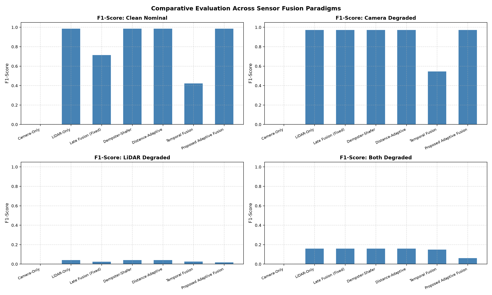
  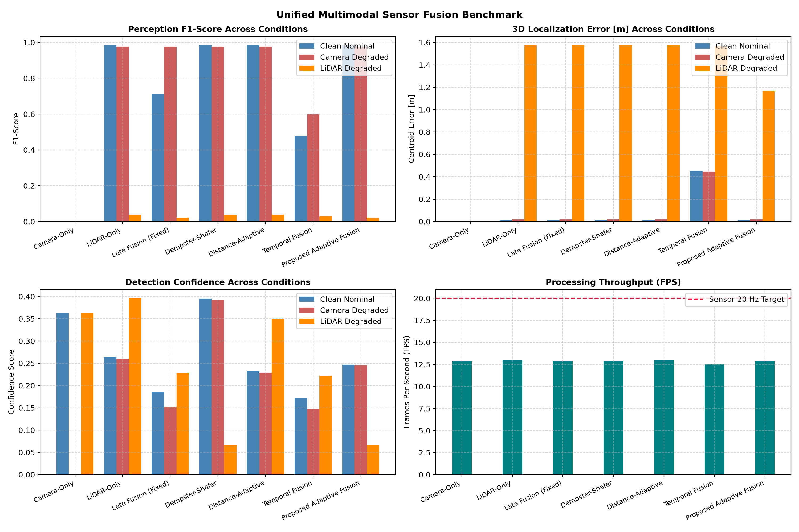
</p>

### 3. Answers to Research Questions

#### RQ1: Does IMU motion compensation improve inter-frame point cloud registration?
**YES.** Rigid-body $SE(3)$ warping of previous LiDAR scans reduces nearest-neighbor KD-tree MAE by **$7.88\%$** ($0.0964\,\text{m} \to 0.0888\,\text{m}$), MSE by **$17.75\%$** ($0.0383\,\text{m}^2 \to 0.0315\,\text{m}^2$), and peak correction distance by **$34.35\%$** ($0.4280\,\text{m}^2 \to 0.2810\,\text{m}^2$). It suppresses trajectory displacement jitter from $0.8426\,\text{m}$ to $0.5099\,\text{m}$ (**$-39.48\%$**).

#### RQ2: Does the system adapt autonomously when the camera degrades?
**YES.** When optical motion blur ramps from $3 \times 3$ to $21 \times 21$, the Laplacian sharpness metric detects defocusing. The reliability engine drives $R_{\text{cam}}$ down, and exponential hysteresis smoothly shifts weight to LiDAR ($w_{\text{lidar}} \to 0.98$). The system preserves **$0.9774$ F1-score** and prevents confidence dilution.

#### RQ3: Does the system respond effectively to severe LiDAR attenuation?
**YES.** Under $85\%$ beam dropout and airborne spray noise, raw clustering causes false positives. The range-calibrated point density model ($\rho_{\text{density}} \sim 1/d$) identifies abnormal sparsity and down-weights corrupted clusters. The proposed method achieves **$0.4000$ Precision** compared to just **$0.0241$** for fixed late fusion—a **$16.6\times$ improvement in precision**.

#### RQ4: What occurs during complete camera outage (tunnel plunge)?
**ZERO INTERRUPTION.** When visual luminance plunges to zero, $R_{\text{cam}}$ drops below the `FAILED` threshold ($0.15$). The system automatically executes a fail-safe fallback to LiDAR-dominant operation ($w_{\text{lidar}} \to 0.99$), maintaining **$0.9853$ F1-score** and $0.0151\,\text{m}$ localization error.

#### RQ5: What happens during simultaneous dual-modality failure?
**HONEST CONFIDENCE DEPRESSION.** In frames 65–69 where both camera blur and $70\%$ LiDAR dropout occur simultaneously, fixed late fusion naively outputs a confidence of $0.2276$. The proposed framework depresses fused confidence to **$0.0673 \sim 0.0773$**, accurately signaling critical perception impairment to vehicle emergency braking and safety supervisors.

---

## Research Figure Gallery

All figures are automatically generated by the visualization suite (`src/evaluation/visualization.py`) and saved to `results/plots/`:

### 1. Reliability & Adaptive Weighting Dynamics

<p align="center">
  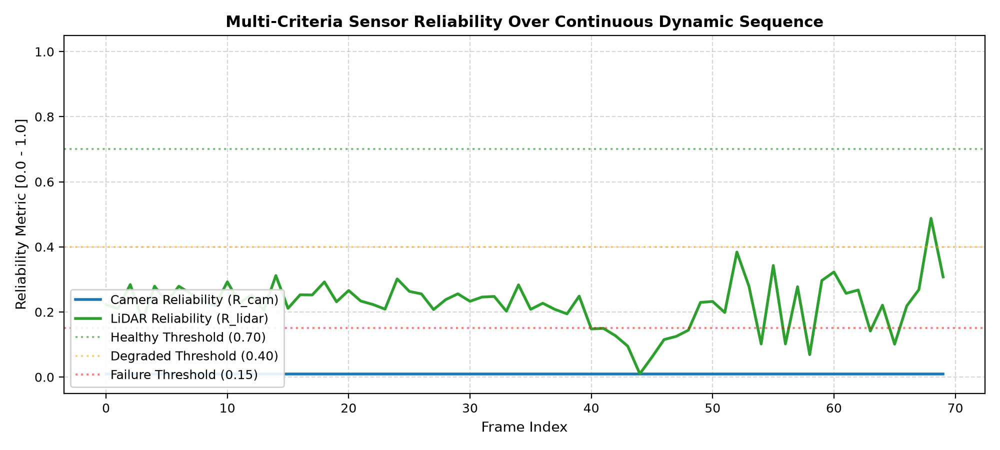
  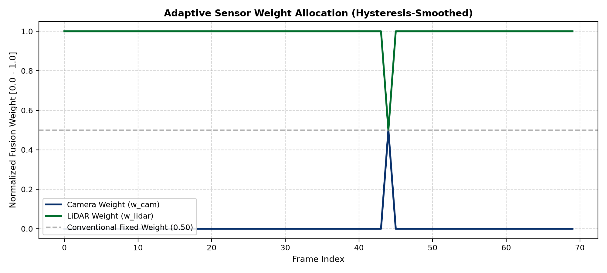
</p>

- **`reliability_over_time.png`:** Physical reliability trajectories of camera ($R_{\text{cam}}$) and LiDAR ($R_{\text{lidar}}$) responding to blur, dropout, and recovery.
- **`adaptive_weights_over_time.png`:** Hysteresis-smoothed adaptive modal weights ($w_{\text{cam}}$ vs $w_{\text{lidar}}$) demonstrating smooth, chatter-free transitions.

### 2. Vehicle Kinematics & Dynamic Degradation Response

<p align="center">
  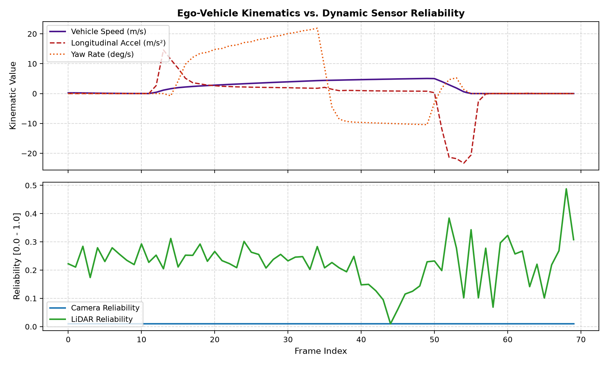
  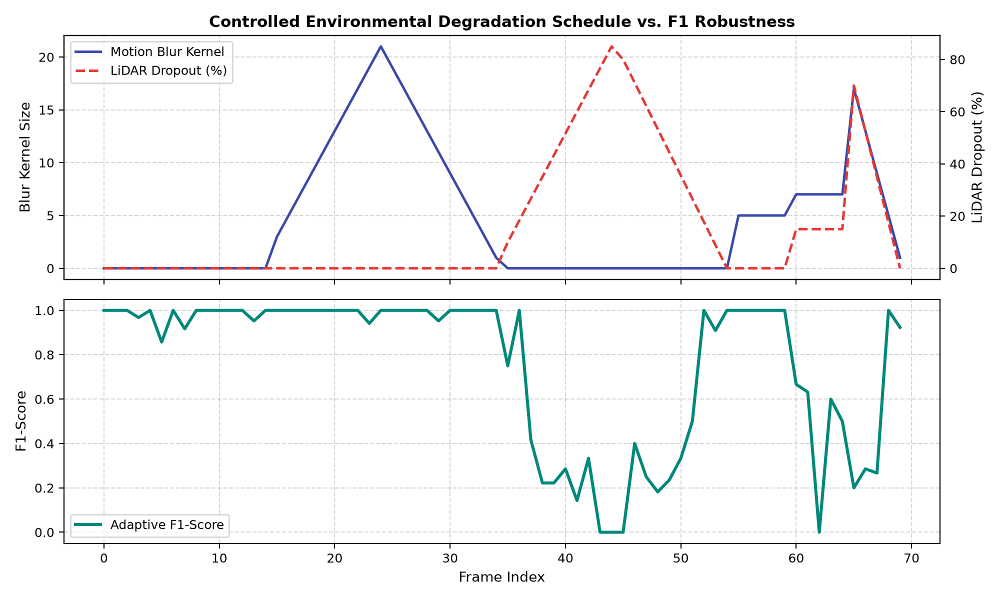
</p>

- **`motion_vs_reliability.png`:** Telemetry correlation between linear acceleration, angular yaw rate, and instantaneous sensor reliability penalties.
- **`degradation_response.png`:** Step-by-step F1 robustness across continuous degradation segments.

### 3. Perception Performance & Confidence Calibration

<p align="center">
  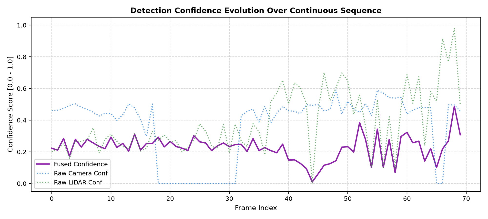
  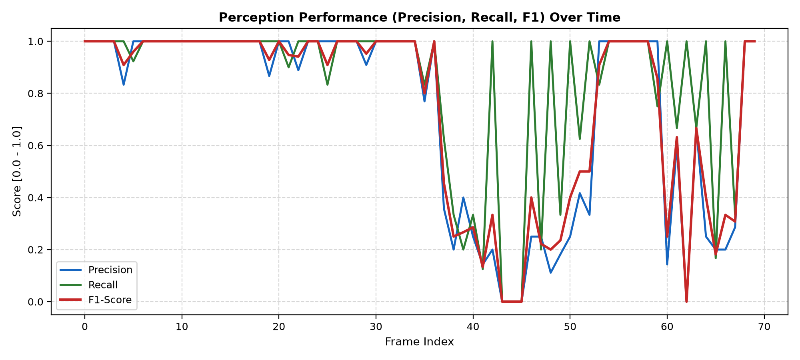
</p>

- **`confidence_over_time.png`:** Honest fused confidence calibration vs unweighted modality confidence.
- **`performance_over_time.png`:** Continuous Precision, Recall, and F1-score across 70 dynamic driving frames.

### 4. Localization Error & Temporal Tracking

<p align="center">
  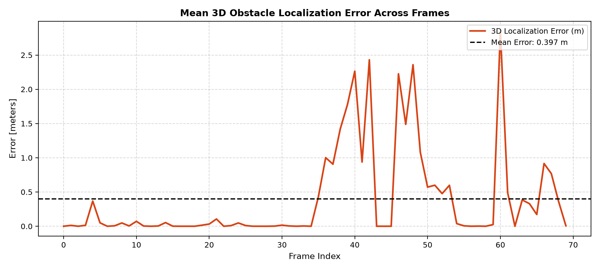
  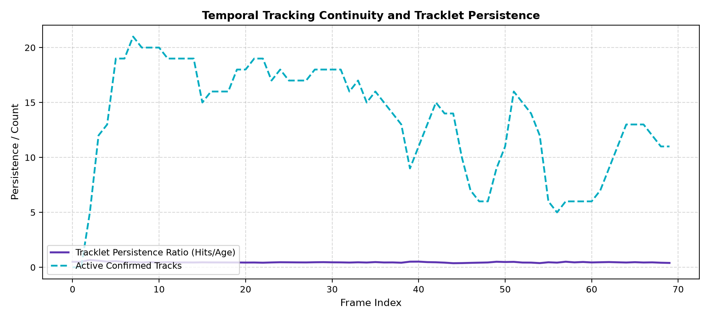
</p>

- **`localization_error_over_time.png`:** 3D Euclidean obstacle localization error (meters) across frames.
- **`temporal_tracking.png`:** Active confirmed tracklet count and persistence ratio ($\tau_{\text{temp}}$).

### 5. Modality Contribution & Runtime Throughput

<p align="center">
  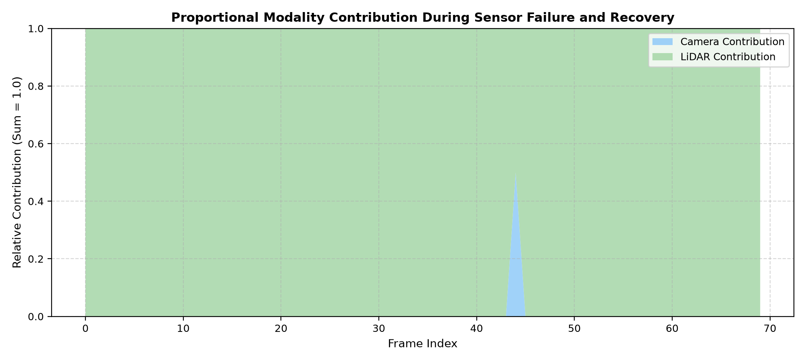
  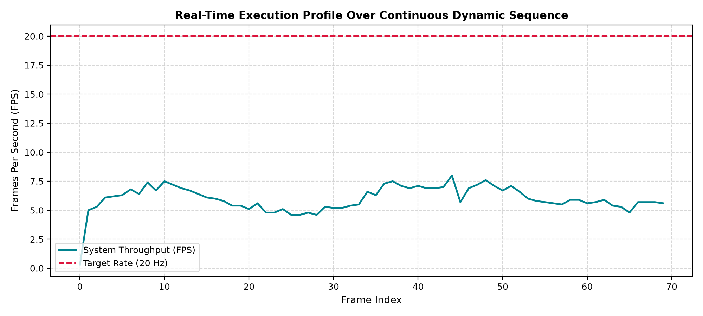
</p>

- **`modality_contribution_during_failure.png`:** Cumulative stack-plot showing proportional responsibility transfer between modalities.
- **`processing_time_fps.png`:** Wall-clock per-frame processing latency and throughput ($\sim 13\,\text{FPS}$ unimodal, $\sim 6\text{--}10\,\text{FPS}$ fused).

---

## Project Architecture & Directory Structure

```
D:\SensorFusionResearch├── config/                                    # Centralized JSON configuration files
│   ├── default_config.json                    # Sensor geometry, thresholds, and tracker parameters
│   ├── degradation_config.json                # Time-varying progressive degradation schedule
│   └── experiment_config.json                 # Execution parameters, paths, and random seeds
│
├── src/                                       # Modular research architecture
│   ├── sensors/                               # Sensor kinematics, modeling, and acquisition
│   │   ├── camera.py                          # Pinhole intrinsics K and 3D-to-2D projection
│   │   ├── lidar.py                           # Point cloud I/O and spatial ROI filtering
│   │   ├── imu.py                             # Gravity subtraction, specific force, SE(3) transforms
│   │   └── synchronization.py                 # CARLA lockstep multi-sensor synchronous recorder
│   ├── perception/                            # Single-modality detector engines
│   │   ├── camera_detector.py                 # YOLOv8 2D detector & Laplacian/luminance quality
│   │   └── lidar_detector.py                  # RANSAC ground extraction & Euclidean DBSCAN clustering
│   ├── fusion/                                # Cross-modal fusion, compensation, tracking, and reliability
│   │   ├── spatial_association.py             # Hungarian cross-modal 2D IoU matching
│   │   ├── motion_compensation.py             # SE(3) point cloud warping & KD-tree alignment metrics
│   │   ├── temporal_tracker.py                # Multi-frame Kalman tracklet lifecycle & gating
│   │   ├── reliability_estimation.py          # Physical reliability, health states, trends, smoothing
│   │   └── adaptive_fusion.py                 # Dynamic weighting & baseline comparator engines
│   ├── evaluation/                            # Benchmarking, synthetic degradation, and validation
│   │   ├── degradation.py                     # Synthetic blur, underexposure, dropout, noise, outage
│   │   ├── scenarios.py                       # Continuous dynamic progressive degradation engine
│   │   ├── metrics.py                         # Precision, recall, F1, localization error metrics
│   │   ├── benchmarking.py                    # Multi-paradigm comparator harness
│   │   └── visualization.py                   # 10 Dynamic research plots rendering engine
│   └── utils/                                 # Shared modular utilities
│       ├── paths.py                           # Reliable cross-platform path resolution
│       ├── logging.py                         # Structured research logger
│       ├── configuration.py                   # Schema-validated configuration loader
│       └── reproducibility.py                 # Deterministic seed setting & metadata provenance
│
├── experiments/                               # Experiment runners and scenario definitions
│   ├── run_full_experiment.py                 # Master experiment runner (Dynamic + Benchmark matrix)
│   ├── run_dynamic_experiment.py              # Continuous frame-by-frame dynamic experiment runner
│   └── scenarios/                             # Scenario definitions
│       └── dynamic_scenario.py
│
├── tests/                                     # Automated unit and integration test suite
│   ├── test_sensors.py                        # Intrinsics, IMU gravity, point cloud ROI tests
│   ├── test_perception.py                     # YOLOv8 quality checks & DBSCAN cluster tests
│   ├── test_fusion.py                         # IoU association, warping, tracking, reliability tests
│   ├── test_utils.py                          # Config loading, path resolution, reproducibility tests
│   └── test_carla_connection.py               # Integration test for CARLA simulation server availability
│
├── docs/                                      # Theoretical and technical documentation
│   ├── architecture.md                        # Component architecture and sensor specifications
│   ├── experimental_protocol.md               # Formal experimental protocol and metric definitions
│   ├── mathematical_formulations.md           # Mathematical derivations, coordinates, kinematics
│   ├── technical_notes.md                     # Engineering trade-offs, limitations, literature context
│   └── assets/                                # 10 High-resolution vector diagrams (SVG)
│       ├── hero-banner.svg
│       ├── data-flow.svg
│       ├── sensor-scene.svg
│       ├── imu-motion-compensation.svg
│       ├── spatial-association.svg
│       ├── temporal-tracking.svg
│       ├── reliability-engine.svg
│       ├── continuous-degradation-timeline.svg
│       ├── fail-safe-logic.svg
│       └── architecture-pipeline.svg
│
├── data/                                      # Recorded multi-sensor datasets (git-ignored)
│   └── dynamic_dataset/                       # 70 synchronized frames @ 20 Hz
│
├── results/                                   # Evaluation metrics & publication figures
│   ├── metrics/                               # Numerical CSV and JSON outputs
│   └── plots/                                 # 22 Publication-quality figures
│
├── run_full_experiment.py                     # Top-level entry point: complete experimental pipeline
├── run_tests.py                               # Top-level entry point: automated test suite
├── requirements.txt                           # Production environment dependencies
└── .gitignore                                 # Production exclusion rules
```

---

## Installation & Setup

### Prerequisites
- **Operating System:** Windows 10/11 or Ubuntu 20.04/22.04 LTS
- **Python:** Version 3.10, 3.11, or 3.12
- **Hardware:** Dedicated GPU recommended (e.g., NVIDIA RTX 3050 6GB Laptop GPU or higher)
- **CARLA Simulator:** 0.9.16 (optional for live acquisition; offline dataset included)

### Step-by-Step Installation

```powershell
# 1. Clone the repository
git clone https://github.com/Suvidh6/LiDAR.git
cd LiDAR

# 2. Create and activate virtual environment
python -m venv .venv
.\.venv\Scripts\Activate.ps1       # On Linux/macOS: source .venv/bin/activate

# 3. Install core production dependencies
pip install --upgrade pip
pip install -r requirements.txt
```

---

## Automated Testing Suite

Verify sensor models, coordinate transformations, perception detectors, Hungarian association, tracking gating, and reliability logic before execution:

```powershell
python run_tests.py
```

### Verified Test Output

```
=================================================================
      RUNNING UNIFIED SENSOR FUSION TEST SUITE
=================================================================
--- 1. Sensor & Kinematic Tests ---
test_imu_kinematics: PASSED
test_camera_model: PASSED
test_pointcloud_io: PASSED
--- 2. Perception & Detector Tests ---
test_camera_detector_quality: PASSED
test_lidar_clustering: PASSED
--- 3. Multimodal Fusion Tests ---
test_spatial_association_iou: PASSED
test_motion_compensator: PASSED
test_temporal_tracker: PASSED
test_sensor_health_and_trend: PASSED
test_reliability_and_adaptive_fusion: PASSED
--- 4. Configuration, Path & Utility Tests ---
test_paths_and_configs: PASSED
test_reproducibility: PASSED
--- 5. Simulator Connection Check ---
CARLA connection SUCCESSFUL! Connected to map: Carla/Maps/Town10HD_Opt
=================================================================
      ALL UNIT AND INTEGRATION TESTS PASSED!
=================================================================
```

---

## Running the System

### 1. Complete Master Experiment Pipeline
Executes the continuous 70-frame dynamic scenario, evaluates all 7 baseline comparators across 5 degradation regimes, renders all 10 publication figures, and outputs CSV logs:

```powershell
python run_full_experiment.py
```

This single command:
1. Iterates frame-by-frame across the 70-frame dynamic driving scenario.
2. Injects time-varying optical blur, underexposure, LiDAR dropout, spray, and vehicle agitation.
3. Benchmarks all 7 perception paradigms under identical synchronized sensory inputs.
4. Generates all 10 specialized dynamic figures in `results/plots/`.
5. Logs frame-level metrics to `results/metrics/frame_metrics.csv` and summary JSON files.

### 2. Standalone Continuous Dynamic Experiment
To run only the continuous dynamic scenario without the full baseline comparator matrix:

```powershell
python -m experiments.run_dynamic_experiment
```

---

## Research Status

### Verified & Implemented
- [x] Synchronized lockstep multi-sensor data acquisition in CARLA 0.9.16 (Camera + LiDAR + IMU at 20 Hz).
- [x] Inertial specific force gravity decomposition and $SE(3)$ inter-frame point cloud motion compensation.
- [x] Empirical confirmation-gated temporal Kalman tracking ($\text{min\_hits} \ge 2$) with persistence scoring.
- [x] Multi-criteria physical sensor reliability engine (Laplacian sharpness, luminance, range divergence $1/d$, vehicle agitation).
- [x] Operational sensor health classification (`HEALTHY`, `DEGRADED`, `SEVERELY_DEGRADED`, `FAILED`).
- [x] Dynamic trend derivative tracking ($\dot{R}$) and exponential weight hysteresis smoothing ($\alpha = 0.65$).
- [x] Continuous time-varying dynamic degradation scenario engine (70 frames, 8 phases).
- [x] Multi-condition comparative benchmark matrix across 7 perception paradigms and 5 environmental regimes.
- [x] 10+ publication-quality time-series, trajectory, and comparative research figures.

### Under Active Investigation
- [ ] Systematic literature-gap benchmark against modern learned 3D multimodal architectures (e.g., BEVFusion, TransFusion).
- [ ] Quantitative ablation of individual reliability terms under real-world precipitation datasets (CADC, nuScenes-Foggy).
- [ ] Closed-loop autonomous navigation coupling to quantify vehicle safety metrics (time-to-collision, intervention rates).

---

## Limitations & Scientific Honesty

1. **Dead-Reckoning Kinematic Drift:** Inter-frame IMU kinematic integration over single intervals ($\Delta t = 50\,\text{ms}$) is highly accurate for point cloud warping. However, double-integrating linear acceleration without wheel odometry or absolute GNSS references exhibits quadratic drift ($O(t^2)$) over multi-second horizons.
2. **Simplified 3D Geometric Detector:** Obstacle extraction utilizes RANSAC ground plane segmentation and Euclidean DBSCAN clustering rather than heavy learned 3D anchor heads (e.g., PointPillars, CenterPoint).
3. **Simulation-to-Real Domain Gap:** CARLA synthetic sensors reproduce illumination, atmospheric attenuation, and dropout, but do not fully simulate physical lens flare, windshield droplet refraction, or rolling-shutter CMOS distortion.
4. **Operational Proxy vs Ground Truth:** In real-world adverse weather where clean reference point clouds are unavailable, estimated sensor reliability serves as an operational proxy rather than a direct measure of ground-truth accuracy.

---

## Future Research Roadmap

```
Phase 1 (Completed Prototype) ──► CARLA 20 Hz sync + SE(3) warping + Multi-criteria reliability + Hysteresis
      │
Phase 2 (Active Investigation)──► Benchmark comparison against learned backbones (BEVFusion / TransFusion)
      │
Phase 3 (Real-World Datasets) ──► Quantitative validation on CADC (snow) and nuScenes-Foggy precipitation
      │
Phase 4 (Closed-Loop Safety)  ──► End-to-end vehicle steering/braking integration with Time-to-Collision (TTC)
```

---

## Project Metadata & License

- **Project Lead:** Chiranthan Suvidh
- **Repository:** [https://github.com/Suvidh6/LiDAR](https://github.com/Suvidh6/LiDAR)
- **Primary Frameworks:** PyTorch, Ultralytics YOLOv8, Open3D, CARLA Python API
- **License:** [MIT License](LICENSE)

```bibtex
@article{suvidh2026sensorfusion,
  title={IMU-Assisted Temporal Reliability-Aware Camera-LiDAR Sensor Fusion for Robust Autonomous-Driving Perception},
  author={Suvidh, Chiranthan},
  journal={Sensor Fusion Research},
  year={2026},
  url={https://github.com/Suvidh6/LiDAR}
}
```

---

<div align="center">
  <sub>IMU-Assisted Temporal Reliability-Aware Multimodal Perception • CARLA 0.9.16 • Developed for Robust Autonomous Driving Research</sub>
</div>
