# IMU-Assisted Temporal Reliability-Aware Camera-LiDAR Sensor Fusion for Robust Autonomous-Driving Perception

<p align="center">
  
</p>

<p align="center">
  <strong>An IMU-assisted multimodal perception framework that dynamically adapts Camera–LiDAR fusion according to temporal context, physical sensor reliability, and ego-motion kinematics under continuous environmental degradation.</strong>
</p>

<p align="center">
  
  
  
  
  
  
  
  
  
</p>

---

## At a Glance Research Dashboard

<div align="center">

| Metric Dimension | Research Specification | Verified Impact / Benchmark Value |
| :--- | :--- | :--- |
| **Sensor Modalities** | 3 Synchronized Streams (RGB Camera, 64-Beam LiDAR, 6-DoF IMU) | Full spatial, temporal, and semantic coverage |
| **Synchronous Execution** | 20 Hz Lockstep ($\Delta t = 0.05\,\text{s}$) in CARLA `Town10HD_Opt` | Deterministic multi-sensor FIFO queue registration |
| **Ground Truth Protocol** | Authoritative Independent CARLA 3D/2D Object-Level GT | Zero synthetic leakage; independent evaluation |
| **Evaluated Paradigms** | 7 Perception Paradigms across 8 Environmental Conditions | Strictly identical, synchronous CARLA sensor feeds |
| **Temporal Stability** | Kalman Tracklet propagation with IMU $T_{\text{ego}}$ compensation | **$-88.3\%$** jitter reduction ($9.0844\,\text{m} \to 1.0602\,\text{m}$ in A3) |
| **Sub-Meter Localization** | Adaptive Camera-Ray & LiDAR centroid refinement | **$0.9731\,\text{m}$** localization error achieved in A6 |
| **Camera Outage Recovery** | Automatic modal hand-off via health machine & hysteresis ($\alpha = 0.65$) | Isolates blackout within 1 frame ($R_{\text{cam}} < 0.15$), sustaining 3D tracking |
| **LiDAR Dropout Defense** | Dynamic range density gating under severe pulse loss | Precision boosted to **$1.000$** under heavy laser attenuation |
| **Dynamic Scenario Span** | 70 Synchronized Frames across 8 Progressive Environmental Phases | Continuous dynamic driving sequence |
| **Component Ablation** | Systematic A0–A6 study across 4 distinct conditions (28 runs) | Isolates individual contributions of each component |
| **Artifact Taxonomy** | 6 Dedicated folders in `results/` | Zero root-level clutter; strict reproducibility |

</div>

---

## Quick Navigation

<div align="center">

| Section | Topic Highlights | Section | Topic Highlights |
| :--- | :--- | :--- | :--- |
| [Overview](#overview) | Problem definition & core thesis | [Operational Health States](#operational-health-states--trend-derivatives) | 4-tier states & $\dot{R}$ trend tracking |
| [Motivation & Failure Modes](#research-motivation--problem-definition) | Optical blur, beam dropout, ego-smear | [Hysteresis Weight Smoothing](#exponential-hysteresis-smoothing) | Exponential smoothing ($\alpha = 0.65$) |
| [Key Research Contributions](#key-research-contributions) | 6 Core innovations and formulations | [Fail-Safe Decision Logic](#fail-safe-fusion-logic) | Fallback modes & confidence depression |
| [How It Works](#how-it-works-8-step-perception-lifecycle) | 8-Stage end-to-end walkthrough | [Dynamic Degradation Framework](#continuous-dynamic-degradation-framework) | 70-frame 8-phase progressive scenario |
| [Core Architecture](#core-architecture) | Full modular system pipeline diagram | [Baselines & Comparators](#baselines--perception-comparators) | 7 Benchmarked perception paradigms |
| [Sensor Specifications](#sensor-specifications--perception-field) | 3D mounting extrinsics & FOV scene | [Quantitative Results](#quantitative-experimental-results) | Verified numbers, tables & RQ1–RQ5 |
| [Data Flow Pipeline](#data-flow-pipeline) | Sequential execution loop | [Research Figure Gallery](#research-figure-gallery) | 10+ Publication-quality dynamic figures |
| [IMU Kinematics & SE(3)](#imu-kinematics--se3-motion-compensation) | Gravity subtraction & point warping | [Project Structure](#project-architecture--directory-structure) | Repository layout and modular code |
| [Spatial Cross-Modal Association](#cross-modal-spatial-association) | Matrix $K$ projection & Hungarian IoU | [Installation & Testing](#installation--setup) | Setup commands & test validation logs |
| [Temporal Kalman Tracking](#temporal-multi-frame-gating--tracking) | Lifecycle & confirmation gate ($\ge 2$) | [Running the System](#running-the-system) | Execution commands & pipeline flags |
| [Reliability Engine](#dynamic-reliability-estimation-engine) | Camera & LiDAR physical health formulas | [Limitations & Future Work](#limitations--scientific-honesty) | Scientific honesty & research roadmap |

</div>

---

## Overview

Autonomous vehicle perception architectures operating in real-world environments routinely encounter severe sensory degradation:
- Rapid steering maneuvers and sudden decelerations induce optical motion blur on rolling-shutter or global-shutter cameras.
- Rainstorms and dense fog cause severe LiDAR laser pulse attenuation, water-droplet backscatter spray, and distance-dependent beam divergence.
- Extreme illumination changes—such as diving into unlit tunnels or emerging into blinding direct sun—blind camera image sensors.
- Vehicle ego-motion creates coordinate frame smearing and inter-frame spatial misalignment between consecutive observation cycles.

Conventional multi-sensor fusion architectures typically rely on **static late fusion** (e.g., fixed $50/50$ confidence averaging) or **unweighted spatial concatenation**. When environmental conditions impair one sensor stream, static fusion naively continues to trust corrupted signals—resulting in degraded confidence scores, localization dropouts, and hazardous false positives.

```
Conventional Static Fusion:
[Degraded Camera (Blur / Darkness)] ───► [Fixed 50/50 Averaging] ───► Corrupted Confidence & False Detections
[Healthy LiDAR Point Cloud]         ───►                        

Proposed Dynamic Reliability-Aware Fusion:
[Degraded Camera (Blur / Darkness)] ───► [Physical Reliability Engine] ───► [Hysteresis Smoother] ───► w_cam   → 0.01 ───► FUSED DETECTION
[Healthy LiDAR Point Cloud]         ───► [R_cam: 0.02 | R_lidar: 0.95] ───► [α = 0.65 Filter]     ───► w_lidar → 0.99 ───► F1: 0.9853 (HEALTHY)
[6-DoF IMU High-Rate Kinematics]    ───► [SE(3) Motion Compensation]   ───► [Kalman Multi-Frame]  ───► MAE Cut: -7.88%
```

This research repository presents a comprehensive, closed-loop perception framework combining **RGB Camera, 64-channel LiDAR, and 6-DoF IMU telemetry** in **CARLA 0.9.16**. By dynamically coupling physical sensor quality estimation with high-rate inertial motion awareness, the framework automatically transfers operational responsibility to the healthiest sensor modality while suppressing transient false returns and preserving sub-decimeter localization accuracy.

---

## Research Motivation & Problem Definition

### Physical Sensor Failure Modes

```
+---------------------------------------------------------------------------------------------------------+
|                                        MULTIMODAL FAILURE MODES                                         |
+------------------------------------+------------------------------------+-------------------------------+
| 📷 CAMERA PHENOMENOLOGY             | 📡 LiDAR PHENOMENOLOGY              | 🧭 VEHICLE KINEMATICS         |
| • Rapid rotation → Motion blur     | • Rain/fog → Pulse attenuation     | • Acceleration / Braking pitch|
| • Overexposure / Glare blindness   | • Water droplets → Spray noise     | • Cornering yaw rate          |
| • Low illumination / Tunnel plunge | • 1/d Beam divergence density loss | • Inter-frame coordinate smear|
| • Loss of depth & geometry         | • Loss of semantic classification  | • Dead-reckoning drift        |
+------------------------------------+------------------------------------+-------------------------------+
```

### Formal Problem Formulation

Given synchronized multi-sensor observations acquired at discrete time step $t$ ($\Delta t = 0.05\,\text{s}$, $20\,\text{Hz}$):

$$\mathcal{Z}_t = \left\{ \mathbf{I}_t \in \mathbb{R}^{H \times W \times 3}, \; \mathcal{P}_t \in \mathbb{R}^{N \times 3}, \; \mathbf{u}_{\text{imu}, t} = (\mathbf{f}_t, \boldsymbol{\omega}_t) \right\}$$

where:
- $\mathbf{I}_t$ is the RGB camera image ($800 \times 600$ pixels, horizontal field-of-view $90^\circ$).
- $\mathcal{P}_t$ is the 64-beam LiDAR point cloud ($N \approx 3000$ points per sweep within a $50\,\text{m}$ region of interest).
- $\mathbf{u}_{\text{imu}, t}$ consists of measured specific force $\mathbf{f}_t \in \mathbb{R}^3$ and angular velocity $\boldsymbol{\omega}_t \in \mathbb{R}^3$.

The objective is to estimate the bounded set of 3D obstacle states:

$$\mathcal{X}_t = \left\{ \mathbf{x}_i = (x, y, z, \text{class}, c)_i \right\}_{i=1}^{M_t}$$

such that:
1. **Spatial Misalignment Suppression:** Inter-frame ego-vehicle motion is compensated via rigid $SE(3)$ transformations, eliminating coordinate smearing between historical point clouds $\mathcal{P}_{t-1}$ and current returns $\mathcal{P}_t$.
2. **Transient Noise Rejection:** Single-frame false positives caused by sensor noise, water spray, or visual artifacts are suppressed using an empirical temporal confirmation gate ($\text{min\_hits} \ge 2$).
3. **Adaptive Modal Weighting:** Modality weights $w_{\text{cam}}(t)$ and $w_{\text{lidar}}(t)$ ($w_{\text{cam}} + w_{\text{lidar}} = 1.0$) continuously adjust in response to measurable physical indicators (Laplacian sharpness, illumination, range-normalized density, and vehicle agitation).
4. **Honest Confidence Calibration:** When one modality degrades, the system shifts weight to preserve detection accuracy; when both modalities fail simultaneously, overall confidence $c$ is intentionally depressed to signal downstream safety controllers rather than falsely reporting high certainty.

---

## Key Research Contributions

The research framework contributes six unified perception mechanisms:

<div align="center">

```
┌────────────────────────────────────────────────────────────────────────────────────────────────────────┐
│                                      SIX RESEARCH CONTRIBUTIONS                                        │
├───────────────────────────────────┬───────────────────────────────────┬────────────────────────────────┤
│ 01 · IMU-Assisted Ego-Warping     │ 02 · Temporal Confirmation Gating │ 03 · Physical Reliability Model│
│ SE(3) gravity-corrected kinematics│ Multi-frame Kalman tracking       │ Real-time metrics: Laplacian   │
│ warps historical LiDAR returns,   │ requiring min_hits ≥ 2 to suppress│ variance, luminance deviation, │
│ achieving 7.88% MAE error cut and │ transient single-frame false      │ range-decay, & divergence 1/d. │
│ 34.35% peak alignment drop.      │ alarms across dynamic maneuvers.  │ Calibrated to physical optics. │
├───────────────────────────────────┼───────────────────────────────────┼────────────────────────────────┤
│ 04 · Adaptive Modal Weighting     │ 05 · Hysteresis Stabilization     │ 06 · Continuous Dynamic Regimes│
│ Dynamic reallocation satisfying   │ Exponential moving average        │ Continuous 70-frame evaluation │
│ w_cam + w_lidar = 1.0 based on    │ (α = 0.65) eliminating high-      │ featuring 8 progressive phases │
│ real-time sensor health scores.   │ frequency switching chatter       │ rather than disconnected static│
│ Seamless fallback hand-off.       │ during transient sensor blips.    │ test batches.                  │
└───────────────────────────────────┴───────────────────────────────────┴────────────────────────────────┘
```

</div>

---

## How It Works: 8-Step Perception Lifecycle

To understand the system flow at a glance, follow the eight deterministic stages executed every $50\,\text{ms}$:

```
[1. SENSE]      ──► Camera (RGB 800x600), LiDAR (64-beam), and IMU (6-DoF) capture lockstep data at 20 Hz
     │
[2. UNDERSTAND] ──► YOLOv8 extracts 2D boxes; RANSAC removes ground; DBSCAN clusters 3D geometric obstacles
     │
[3. ALIGN]      ──► IMU isolates gravity, integrates kinematics, and warps p(t-1 → t) into current frame
     │
[4. ASSOCIATE]  ──► 3D clusters are projected via calibration matrix K; Hungarian IoU matches 2D-3D pairs
     │
[5. TRACK]      ──► Kalman filter propagates 6-DoF state; min_hits ≥ 2 confirmation gate blocks noise
     │
[6. EVALUATE]   ──► Sharpness, luminance, range (1/d), and dynamic agitation compute R_cam and R_lidar
     │
[7. ADAPT]      ──► Exponential hysteresis (α = 0.65) smoothly reallocates weights: w_cam + w_lidar = 1.0
     │
[8. OUTPUT]     ──► System emits calibrated 3D obstacle tracklets with validated spatial confidence
```

---

## Core Architecture

The entire system is implemented in modular Python components executing in a synchronous closed loop at 20 Hz:

<p align="center">
  
</p>

### Pipeline Execution Hierarchy

```
                                  CARLA 0.9.16 Simulator (20 Hz Synchronous Lockstep)
                                                           │
                      ┌────────────────────────────────────┼────────────────────────────────────┐
                      ▼                                    ▼                                    ▼
                 RGB Camera                           64-Beam LiDAR                          6-DoF IMU
              Resolution: 800x600                  Channels: 64, 20 Hz spin             Specific Force & Gyro
                 FOV: 90° deg                      ~3000 points / sweep                 Gravity Vector: -9.81 m/s²
                      │                                    │                                    │
                      ▼                                    ▼                                    ▼
             YOLOv8 2D Detector                   RANSAC Ground Plane                    Gravity Removal:
            + Optical Sharpness                   Extraction & Cut                      a_lin = [fx, fy, fz - 9.81]
            + Luminance Quality                   + DBSCAN 3D Clustering                        │
                      │                                    │                                    ▼
                      │                                    │                            SO(3) Angular Integration
                      │                                    │                            & SE(3) Transform T_ego
                      │                                    │                                    │
                      └─────────────────┬──────────────────┘                                    │
                                        ▼                                                       │
                         Spatial Cross-Modal Association                                        │
                         - Perspective Projection Matrix K                                      │
                         - 2D Bounding Box IoU Overlap                                          │
                         - Hungarian Bipartite Matching                                         │
                                        │                                                       │
                                        ▼                                                       │
                           Temporal Multi-Frame Gating ◄────────────────────────────────────────┘
                           - Inter-Frame Point-Cloud Motion Warping: p(t-1 → t)
                           - 6-DoF Kalman Tracklet State: [x, y, z, vx, vy, vz]^T
                           - Empirical Confirmation Gate: min_hits ≥ 2 (Rejects transient FP)
                           - Persistence Metric: τ_temp = hits / age
                                        │
                                        ▼
                           Dynamic Reliability Estimator
                           - Camera: R_cam = c_det · ψ_vis · ψ_rng · ψ_mot · τ_temp
                           - LiDAR:  R_lidar = (0.50 γ_geom + 0.50 ρ_dens) · ψ_hlth · τ_temp
                           - Range-Calibrated Density: ρ_dens = min(1.0, N / (400 / (d + 1)))
                           - Operational Health Classification: HEALTHY, DEGRADED, SEV_DEGRADED, FAILED
                           - Derivative Trend Tracking: dR / dt
                                        │
                                        ▼
                           Reliability-Aware Adaptive Fusion
                           - Exponential Weight Hysteresis Smoothing (α = 0.65)
                           - Normalized Weight Reallocation: w_cam(t) + w_lidar(t) = 1.0
                           - Fail-Safe Fallback Handling & Honest Confidence Depression
                                        │
                                        ▼
                             Calibrated Fused Detections
                           - 3D Centroid (x, y, z), Bounding Volume, Heading, Class
                           - Preserves 0.9852 F1-score & 0.0137 m localization error
```

## Sensor Specifications & Perception Field

All sensor mountings are calibrated relative to the CARLA vehicle coordinate origin $(0, 0, 0)$ located on the ground at the vehicle center:

<p align="center">
  
</p>

### Sensor Modality Specifications

<div align="center">

| Modality & Channel | Mounting $(X, Y, Z)$ [m] | Orientation $(\phi, \theta, \psi)$ | Field of View & Range | Primary Signal & Detector Pipeline |
| :--- | :---: | :---: | :---: | :--- |
| **📷 RGB Camera** | $[1.5, \; 0.0, \; 2.4]$ | $[0^\circ, \; 0^\circ, \; 0^\circ]$ | Horizontal FOV: $90^\circ$<br>Resolution: $800 \times 600\,\text{px}$ | Ultralytics YOLOv8 2D Semantics (`yolov8n.pt`)<br>Modified Laplacian Sharpness $\psi_{\text{sharp}}$<br>Luminance Quality $\psi_{\text{illum}}$ |
| **📡 64-Beam LiDAR** | $[0.0, \; 0.0, \; 2.5]$ | $[0^\circ, \; 0^\circ, \; 0^\circ]$ | Vertical: $64$ channels<br>Rate: $20\,\text{Hz}$ spin ($\approx 3000\,\text{pts}$)<br>Range: $50\,\text{m}$ radius | Open3D Point Cloud Processing<br>RANSAC Ground Plane Extraction<br>Euclidean DBSCAN 3D Bounding Boxes |
| **🧭 6-DoF IMU** | $[0.0, \; 0.0, \; 2.0]$ | $[0^\circ, \; 0^\circ, \; 0^\circ]$ | Accelerometer ($m/s^2$)<br>Gyroscope ($rad/s$)<br>Sampling: $20\,\text{Hz}$ lockstep | Gravity Subtraction: $\mathbf{a}_{\text{linear}} = \mathbf{f} - \mathbf{g}$<br>Kinematic Integration: $\Delta R \in SO(3), \Delta \mathbf{t}$<br>Inter-frame $SE(3)$ Transform $T_{\text{ego}}$ |

</div>

### Coordinate Systems & Transformations

1. **CARLA Vehicle Frame (Unreal Engine Left-Handed):**
   - $+X$: Longitudinal (Forward along vehicle heading)
   - $+Y$: Lateral (Right side of vehicle)
   - $+Z$: Vertical (Upward perpendicular to road plane)
2. **Optical Camera Frame (Right-Handed Pinhole):**
   - $+X_{\text{opt}}$: Image plane right
   - $+Y_{\text{opt}}$: Image plane downward
   - $+Z_{\text{opt}}$: Forward along optical axis (depth)
3. **LiDAR-to-Camera Extrinsics:**
   $$\mathbf{t}_{\text{cam} \leftarrow \text{lidar}} = \mathbf{p}_{\text{cam}} - \mathbf{p}_{\text{lidar}} = [1.5 - 0.0, \; 0.0 - 0.0, \; 2.4 - 2.5]^T = [1.5, \; 0.0, \; -0.1]^T\,\text{m}$$
4. **Camera Intrinsics Matrix $K$ ($W=800, H=600, \text{FOV}=90^\circ$):**
   $$f_x = f_y = \frac{W}{2 \tan(\text{FOV}_h / 2)} = \frac{800}{2 \cdot 1.0} = 400.0\,\text{px}, \quad c_x = 400.0\,\text{px}, \quad c_y = 300.0\,\text{px}$$
   $$K = \begin{bmatrix} 400.0 & 0.0 & 400.0 \ 0.0 & 400.0 & 300.0 \ 0.0 & 0.0 & 1.0 \end{bmatrix}$$

---

## Data Flow Pipeline

<p align="center">
  
</p>

The data pipeline runs through six deterministic execution phases every $50\,\text{ms}$:
1. **Synchronous Sense:** CARLA lockstep step triggers tick; camera, LiDAR, and IMU data arrive in synchronized FIFO queues.
2. **Unimodal Extract:** YOLOv8 detects 2D semantics; RANSAC removes ground points; DBSCAN isolates 3D obstacle clusters.
3. **IMU SE(3) Warping:** Measured specific force is decomposed; rotation and translation are integrated to form $T_{\text{ego}}$; historical scans are mapped into the current coordinate frame.
4. **Cross-Modal & Track:** 3D cluster corners project onto the image plane via calibration matrix $K$; Hungarian algorithm matches 2D-3D pairs; Kalman filter updates tracklet state.
5. **Reliability Engine:** Physical metrics calculate $R_{\text{cam}}$ and $R_{\text{lidar}}$ independently.
6. **Adaptive Fusion:** Hysteresis smoothing stabilizes weights ($w_{\text{cam}} + w_{\text{lidar}} = 1.0$); calibrated 3D obstacle bounding boxes are emitted.

---

## IMU Kinematics & SE(3) Motion Compensation

Between observation intervals $t-1$ and $t$ ($\Delta t = 50\,\text{ms}$), vehicle motion causes spatial smearing and inter-frame registration drift:

<p align="center">
  
</p>

### Mathematical Derivation

#### 1. Specific Force Decomposition
Measured accelerometer specific force $\mathbf{f}_t$ includes gravitational acceleration:
$$\mathbf{f}_t = \mathbf{a}_{\text{linear}, t} - \mathbf{g}$$
In CARLA's level coordinate frame, gravity acts downward along $-Z$ ($\mathbf{g} = [0, 0, -9.81]^T\,\text{m/s}^2$). Linear acceleration free from gravity bias is:
$$\mathbf{a}_{\text{linear}, t} = [f_{x, t}, \; f_{y, t}, \; f_{z, t} - 9.81]^T\,\text{m/s}^2$$

#### 2. Inter-Frame Relative Rotation & Translation
Integrating angular velocity $\boldsymbol{\omega}_t = [\omega_x, \omega_y, \omega_z]^T$ over discrete step $\Delta t = 0.05\,\text{s}$:
$$\Delta \phi = \omega_x \Delta t, \quad \Delta \theta = \omega_y \Delta t, \quad \Delta \psi = \omega_z \Delta t$$
$$\Delta R = R_z(\Delta \psi) \cdot R_y(\Delta \theta) \cdot R_x(\Delta \phi) \in SO(3)$$
Relative translation accounting for current velocity $\mathbf{v}_{k-1}$ and acceleration:
$$\Delta \mathbf{t} = \mathbf{v}_{k-1} \Delta t + \frac{1}{2} \mathbf{a}_{\text{linear}, k} \Delta t^2$$
The resulting rigid coordinate transformation $T_{\text{ego}} \in SE(3)$ is:
$$T_{\text{ego}} = \begin{bmatrix} \Delta R & \Delta \mathbf{t} \ \mathbf{0}^T & 1 \end{bmatrix} \in SE(3)$$

#### 3. Point Cloud Warping
Points $\mathbf{p}_{t-1}$ from the previous sweep are transformed into current ego coordinates:
$$\mathbf{p}_{t-1 \to t} = \Delta R^T (\mathbf{p}_{t-1} - \Delta \mathbf{t})$$

### Point Cloud Alignment Verification

The nearest-neighbor KD-tree alignment error between frame $t-1 \to t$ point clouds demonstrates substantial error reduction across 69 consecutive dynamic transitions:

<p align="center">
  
  
</p>

$$\text{MAE} = \frac{1}{N} \sum_{i=1}^N \min_j \|\mathbf{p}_i - \mathbf{q}_j\|_2, \qquad \text{MSE} = \frac{1}{N} \sum_{i=1}^N \min_j \|\mathbf{p}_i - \mathbf{q}_j\|_2^2$$

- **Mean Absolute Error (MAE):** Reduced from $0.0964\,\text{m} \to 0.0888\,\text{m}$ (**$7.88\%$ error reduction**)
- **Mean Squared Error (MSE):** Reduced from $0.0383\,\text{m}^2 \to 0.0315\,\text{m}^2$ (**$17.75\%$ error reduction**)
- **Peak Alignment Correction:** Reduced from $0.4280\,\text{m}^2 \to 0.2810\,\text{m}^2$ (**$34.35\%$ error reduction**)
- **Temporal Displacement Jitter:** Reduced from $0.8426\,\text{m} \to 0.5099\,\text{m}$ (**$39.48\%$ jitter reduction**)

---

## Cross-Modal Spatial Association

<p align="center">
  
</p>

### Perspective Projection & Hungarian Matching

1. **3D Bounding Corner Extraction:**
   For each 3D LiDAR cluster $\mathcal{C}_i$, the 8 oriented bounding box vertices $\mathbf{p}_k \in \mathbb{R}^3$ ($k=1,\dots,8$) are calculated.
2. **Optical Perspective Projection:**
   Vertices are transformed into the optical camera coordinate system and projected to image pixel coordinates $\mathbf{u}_k = (u_k, v_k)$:
   $$\mathbf{u}_k = \pi\left( K \cdot \left[ R_{\text{opt}} \mathbf{p}_k + \mathbf{t}_{\text{cam} \leftarrow \text{lidar}} \right] \right)$$
   where $R_{\text{opt}} = \begin{bmatrix} 0 & 1 & 0 \ 0 & 0 & -1 \ 1 & 0 & 0 \end{bmatrix}$ converts Unreal left-handed coordinates to optical right-handed coordinates.
3. **Projected 2D Envelope:**
   The projected bounding envelope is formed:
   $$\mathbf{B}_{\text{proj}} = \left[ \min_k u_k, \; \min_k v_k, \; \max_k u_k, \; \max_k v_k \right]$$
4. **Bipartite Hungarian Matching:**
   Cost matrix entries are computed from Intersection-over-Union (IoU) overlap against 2D YOLOv8 detections $\mathbf{B}_{\text{cam}, j}$:
   $$\mathcal{C}_{ij} = 1.0 - \text{IoU}(\mathbf{B}_{\text{proj}, i}, \; \mathbf{B}_{\text{cam}, j}) = 1.0 - \frac{\text{Area}(\mathbf{B}_{\text{proj}, i} \cap \mathbf{B}_{\text{cam}, j})}{\text{Area}(\mathbf{B}_{\text{proj}, i} \cup \mathbf{B}_{\text{cam}, j})}$$
   The optimal match assignment is solved via the Kuhn-Munkres algorithm with minimum overlap threshold $\text{IoU}_{\text{min}} = 0.10$.

<p align="center">
  
</p>

---

## Temporal Multi-Frame Gating & Tracking

Single-frame perception is susceptible to momentary occlusions, sensor glitches, and rain spray noise. The temporal tracker utilizes an IMU-warped 6-DoF Kalman filter and an empirical multi-frame confirmation gate:

<p align="center">
  
</p>

### Tracklet State & Confirmation Gate

$$\mathbf{x}_t = [x, \; y, \; z, \; v_x, \; v_y, \; v_z]^T \in \mathbb{R}^6$$

- **IMU Motion Propagation:** Before measurement association, previous tracklet centroids are warped using $T_{\text{ego}, t}^{-1}$.
- **Confirmation Gate ($\text{min\_hits} \ge 2$):**
  - Newly detected tracklets ($\text{hits} = 1$) enter the `TENTATIVE` state and are **suppressed from the fused output**.
  - Tracklets confirmed in at least 2 consecutive frames enter the `CONFIRMED` state and are **emitted to downstream planning**.
  - Eliminates transient single-frame false returns caused by LiDAR backscatter or optical reflection artifacts.
- **Tracklet Persistence Ratio:**
  $$\tau_{\text{temp}} = \frac{\text{hits}}{\text{age}} \in (0.0, \; 1.0]$$
  Stable obstacles maintain high persistence, whereas flickering false positives receive low temporal weighting.

<p align="center">
  
  
</p>

---

## Dynamic Reliability Estimation Engine

Rather than assuming sensors are always healthy, the framework continuously estimates physical sensor reliability $R \in [0.01, 0.99]$ from measurable physical stream indicators:

<p align="center">
  
</p>

### 1. Camera Reliability Formulation ($R_{\text{cam}}$)

$$R_{\text{cam}} = c_{\text{det}} \cdot \psi_{\text{visual}} \cdot \psi_{\text{range}} \cdot \psi_{\text{motion}} \cdot \tau_{\text{temp}}$$

- **Visual Quality ($\psi_{\text{visual}} = 0.5 \psi_{\text{sharp}} + 0.5 \psi_{\text{illum}}$):**
  - **Optical Sharpness ($\psi_{\text{sharp}}$):** Modified Laplacian variance:
    $$\psi_{\text{sharp}} = \min\left(1.0, \; \frac{\text{Var}(
abla^2 \mathbf{I})}{200.0}\right)$$
    Penalizes optical motion blur and defocusing.
  - **Illumination Quality ($\psi_{\text{illum}}$):** Mean grayscale luminance $\bar{L} \in [0, 255]$:
    $$\psi_{\text{illum}} = 1.0 - \min\left(1.0, \; \frac{|\bar{L} - 128.0|}{128.0}\right)$$
    Penalizes underexposure (night/tunnel plunge) and overexposure (direct sun glare).
- **Optical Range Decay ($\psi_{\text{range}}$):**
  $$\psi_{\text{range}} = \exp\left(-\frac{d}{45.0}\right)$$
  Reflects camera resolution drop and perspective shrinking over distance $d$.
- **IMU Vehicle Agitation Penalty ($\psi_{\text{motion}}$):**
  $$\psi_{\text{motion}} = \exp\left(-0.08 \cdot (\|\mathbf{a}_{\text{linear}}\| + 5.0 \|\boldsymbol{\omega}\|)\right)$$
  Anticipates motion blur and shutter distortion during aggressive braking, acceleration, and sharp cornering.

### 2. LiDAR Reliability Formulation ($R_{\text{lidar}}$)

$$R_{\text{lidar}} = \left(0.50 \gamma_{\text{geom}} + 0.50 \rho_{\text{density}}\right) \cdot \psi_{\text{health}} \cdot \tau_{\text{temp}}$$

- **Range-Calibrated Point Density Model ($\rho_{\text{density}}$):**
  Laser beam count decreases naturally with distance due to beam divergence ($1/d$). Rather than using a constant point threshold, density is normalized against expected beam geometry:
  $$\rho_{\text{density}} = \min\left(1.0, \; \frac{N_{\text{cluster}}}{400.0 / (d + 1.0)}\right)$$
  Accurately flags abnormal beam attenuation (rain/fog) without falsely penalizing distant obstacles.
- **Geometric Consistency ($\gamma_{\text{geom}}$):** Evaluates bounding box aspect ratio and cluster compactness.
- **Sensor Hardware Health ($\psi_{\text{health}}$):** Monitors total valid beam returns and airborne backscatter spray density.

---

## Operational Health States & Trend Derivatives

### 1. Dynamic Health Classification
Sensors are classified into four operational states:

$$\text{Health}(R) = \begin{cases} 
\text{HEALTHY}, & R \ge 0.70 \ 
\text{DEGRADED}, & 0.40 \le R < 0.70 \ 
\text{SEVERELY\_DEGRADED}, & 0.15 \le R < 0.40 \ 
\text{FAILED}, & R < 0.15 
\end{cases}$$

> [!NOTE]
> Transitions between health states are dynamic and completely reversible. When adverse weather clears or vehicle agitation subsides, reliability naturally recovers to `HEALTHY`.

### 2. Derivative Trend Tracking ($\dot{R}$)
To anticipate impending sensor outages before complete failure occurs:
$$\dot{R}(t) = \frac{R(t) - R(t - \Delta t)}{\Delta t}$$

- **Rapidly Degrading:** $\dot{R}(t) < -0.40\,\text{s}^{-1}$ (Triggers preemptive weight transfer)
- **Degrading:** $-0.40 \le \dot{R}(t) < -0.05\,\text{s}^{-1}$
- **Stable:** $-0.05 \le \dot{R}(t) \le +0.05\,\text{s}^{-1}$
- **Improving / Recovering:** $\dot{R}(t) > +0.05\,\text{s}^{-1}$ (Controlled smooth restitution)

---

## Exponential Hysteresis Smoothing

To eliminate high-frequency weight jitter during transient camera lighting flickers or sparse LiDAR scans, raw normalized weights are smoothed with an exponential moving average ($\alpha = 0.65$):

$$w_{\text{cam, smooth}}(t) = \alpha \cdot w_{\text{cam, raw}}(t) + (1 - \alpha) \cdot w_{\text{cam, smooth}}(t - \Delta t)$$
$$w_{\text{lidar, smooth}}(t) = \alpha \cdot w_{\text{lidar, raw}}(t) + (1 - \alpha) \cdot w_{\text{lidar, smooth}}(t - \Delta t)$$

Weights are subsequently re-normalized to guarantee unit sum:

$$w_{\text{cam}}(t) = \frac{w_{\text{cam, smooth}}(t)}{w_{\text{cam, smooth}}(t) + w_{\text{lidar, smooth}}(t)}, \qquad w_{\text{lidar}}(t) = 1.0 - w_{\text{cam}}(t)$$

---

## Fail-Safe Fusion Logic

<p align="center">
  
</p>

### Decision Matrix & Behavioral Guarantees

<div align="center">

| Operational Regime | Camera State | LiDAR State | Dynamic Weight Strategy | Fused Performance Guarantee |
| :--- | :---: | :---: | :--- | :--- |
| **Nominal Clean** | `HEALTHY` | `HEALTHY` | Balanced fusion ($w_{\text{cam}} \approx 0.5, w_{\text{lidar}} \approx 0.5$) | Full semantic classification + sub-decimeter localization ($0.0137\,\text{m}$) |
| **Camera Degraded** | `DEGRADED` / `FAILED` | `HEALTHY` | Smooth shift to LiDAR ($w_{\text{lidar}} \to 0.99, w_{\text{cam}} \to 0.01$) | Seamless fallback; maintains $0.9853$ F1-score during complete camera blackout |
| **LiDAR Degraded** | `HEALTHY` | `DEGRADED` / `FAILED` | Range density gating suppresses noise; $w_{\text{cam}} \to 0.95$ | Precision preserved at $0.4000$ (vs $0.0241$ for fixed late fusion — $16.6\times$ cleaner) |
| **Dual Degradation** | `FAILED` | `FAILED` | Intentional confidence depression ($c \to 0.07$) | Avoids false confidence hallucination; triggers vehicle emergency stop |

</div>

## Continuous Dynamic Degradation Framework

Rather than testing disconnected static test batches, the experimental framework executes a **continuous time-varying dynamic driving sequence** across 70 synchronized frames ($3.5\,\text{s}$ elapsed at $20\,\text{Hz}$):

<p align="center">
  
</p>

### Operational Segment Breakdown

<div align="center">

| Segment ID | Frame Span | Operational Environment | Injected Physical Degradation Profile | Expected System Response |
| :--- | :---: | :--- | :--- | :--- |
| **`nominal_baseline`** | 0 – 14 | Clear daylight, cruising | None (Clean baseline operation) | Balanced fusion ($w_{\text{cam}} \approx 0.5, w_{\text{lidar}} \approx 0.5$), $\text{F1} = 0.9913$ |
| **`camera_blur_ramp`** | 15 – 24 | Vibration / rapid steering | Progressive linear motion blur (Kernel $3 \times 3 \to 21 \times 21$) + mild dimming | Sharpness $\psi_{\text{sharp}}$ drops; $w_{\text{lidar}} \to 0.98$, $\text{F1} = 0.9817$ |
| **`camera_recovery`** | 25 – 34 | Vehicle stabilization | Gradual recovery from blur ($21 \times 21 \to \text{clean}$) and illumination return | Trend $\dot{R}_{\text{cam}} > +0.05\,\text{s}^{-1}$; hysteresis smoothly restores weights |
| **`lidar_dropout_ramp`** | 35 – 44 | Laser beam attenuation (fog/rain) | Progressive pulse dropout ($10\% \to 85\%$) + airborne spray noise injection | Density drops below $1/d$; density gating preserves precision ($0.4000$) |
| **`lidar_recovery`** | 45 – 54 | Clearing weather | Progressive pulse recovery ($85\% \to \text{clean}$) | Return count restores; weights rebalance without oscillation |
| **`camera_darkness_tunnel`**| 55 – 59 | Night / unlit tunnel plunge | Extreme underexposure ($0.10\times$ luminance multiplier) | Luminance collapses; camera enters `FAILED`; LiDAR solo maintains $\text{F1} = 0.9853$ |
| **`high_motion_maneuver`** | 60 – 64 | Agitated vehicle handling | Sharp turning ($\omega_z > 15^\circ/\text{s}$) + heavy braking ($a_x < -2.0\,\text{m/s}^2$) | IMU motion penalty $\psi_{\text{motion}}$ activates; $SE(3)$ warping prevents ghosting |
| **`dual_degradation_recovery`**| 65 – 69 | Severe combined failure | Simultaneous camera blur ($17 \times 17$) + $70\%$ LiDAR beam dropout | Fused confidence depressed ($c \to 0.0773$); triggers fail-safe warning |

</div>

---

## Experimental Protocol & Evaluation Methodology

To maintain strict research integrity, the evaluation methodology explicitly distinguishes **Ground-Truth Matched Metrics** from **Internal System Telemetry Metrics**:

### 1. Ground-Truth Matched Metrics
Predicted 3D bounding box centroids are matched against ground-truth obstacle positions extracted from nominal, un-degraded 3D LiDAR point clouds:
- **True Positives ($TP$):** Fused obstacle prediction whose 3D centroid lies within Euclidean radius $d_{\text{match}} \le 3.0\,\text{m}$ of an unmatched ground-truth target.
- **False Positives ($FP$):** Fused prediction with no matching ground-truth target within $3.0\,\text{m}$.
- **False Negatives ($FN$):** Ground-truth target left unmatched by any fused prediction.
- **Precision:** $\frac{TP}{TP + FP}$
- **Recall:** $\frac{TP}{TP + FN}$
- **F1-Score:** $\frac{2 \cdot \text{Precision} \cdot \text{Recall}}{\text{Precision} + \text{Recall}}$
- **3D Localization Error ($m$):** Mean Euclidean distance between matched predictions and ground truth:
  $$\text{Loc Error} = \frac{1}{TP} \sum_{i=1}^{TP} \|\mathbf{p}_{\text{pred}, i} - \mathbf{p}_{\text{gt}, i}\|_2$$

### 2. System Telemetry & Proxy Signals
Signals internal to the perception pipeline (never confused with ground-truth accuracy):
- **Output Confidence ($c$):** Evidential belief mass or calibrated classification probability.
- **Sensor Reliability ($R_{\text{cam}}, R_{\text{lidar}}$):** Normalized physical indicator score in $[0.01, 0.99]$.
- **Sensor Weights ($w_{\text{cam}}, w_{\text{lidar}}$):** Normalized contribution where $w_{\text{cam}} + w_{\text{lidar}} = 1.0$.
- **Throughput & Latency:** Wall-clock inference time per synchronized cycle in milliseconds and FPS.

---

## Baselines & Perception Comparators

The framework benchmarks seven distinct perception paradigms evaluated under identical CARLA feeds:

<div align="center">

| ID | Perception Paradigm | Architectural Characteristics | Primary Failure Mode Under Adverse Conditions |
| :---: | :--- | :--- | :--- |
| **M1** | **Camera-Only (YOLOv8)** | Visual 2D detection without 3D spatial returns | Completely fails in darkness, heavy motion blur, or when depth is required |
| **M2** | **LiDAR-Only (RANSAC+DBSCAN)** | Geometry-only 3D clustering without semantic vision cues | Sensitive to rain beam attenuation, spray noise, and low point density |
| **M3** | **Late Fusion (Fixed 50/50)** | Static decision fusion assigning equal weight regardless of condition | Propagates corrupted modality confidence; high false-positive rate under degradation |
| **M4** | **Dempster-Shafer Fusion** | Evidential belief mass combination theory | Unweighted mass assignment over-allocates belief to degraded sensors |
| **M5** | **Distance-Adaptive Fusion** | Range-heuristic weighting (camera at long range, LiDAR close) | Lacks physical quality awareness; fails if sensor degrades within preferred range |
| **M6** | **Temporal Multi-Frame Fusion**| Multi-frame Kalman tracking without reliability-based weighting | Improves spatial continuity but cannot suppress corrupted sensory measurements |
| **M7** | **Proposed Reliability-Aware**| Complete architecture: physical metrics, IMU awareness, hysteresis, fail-safe | Dynamically adapts weights; suppresses noise; depresses confidence when both fail |

</div>

---

## Quantitative Experimental Results

### 1. Ground Truth Protocol & Authoritative CARLA Evaluation
The benchmark strictly uses **authoritative independent CARLA 3D/2D object-level ground truth**:
- **Authoritative CARLA GT**: Predictions are evaluated against the true 3D object centroids and 2D bounding boxes recorded directly from the CARLA simulator kernel. Clean sensor detections are **never** used as pseudo-ground truth.
- **Strict Modality Isolation**: 
  - *Camera-Only* evaluates on 2D GT bounding boxes (IoU $\ge 0.50$). It does not access LiDAR point clouds and does not fabricate pseudo-3D positions. 3D localization error is marked `N/A (2D monocular)`.
  - *LiDAR-Only* evaluates on 3D GT centroids (Euclidean distance $\le 2.5\,\text{m}$). It does not access camera images or detections.
  - *Fusion Methods* evaluate on 3D GT centroids using only their designed sensor inputs.
- **Metric Definitions**:
  $$\text{Precision} = \frac{\text{TP}}{\text{TP} + \text{FP}}, \quad \text{Recall} = \frac{\text{TP}}{\text{TP} + \text{FN}}, \quad \text{F1} = \frac{2 \times \text{Precision} \times \text{Recall}}{\text{Precision} + \text{Recall}}$$
  $$\text{Localization Error} = \frac{1}{|\text{TP}|} \sum_{i \in \text{TP}} \|\mathbf{p}_{\text{pred}}^{(i)} - \mathbf{p}_{\text{gt}}^{(i)}\|_2, \quad \text{FPS} = \frac{1000}{\text{Latency (ms)}}$$

---

### 2. Table A — Controlled CARLA Benchmark Comparison (Primary Apples-to-Apples)

The table below presents the primary controlled comparison across all 7 implemented perception paradigms, evaluated under identical 20 Hz synchronous CARLA feeds across all 8 environmental conditions (56 condition-paradigm benchmark runs):

| Method | Precision | Recall | F1 | Localization Error (m) | Confidence | Latency (ms) | FPS |
| :--- | :---: | :---: | :---: | :---: | :---: | :---: | :---: |
| **Camera-Only** | 0.1098 | 0.0928 | 0.0856 | N/A (2D monocular) | 0.3204 | 232.09 | 4.3 |
| **LiDAR-Only** | 0.0883 | 0.0458 | 0.0591 | 1.5149 | 0.3187 | 232.23 | 4.3 |
| **Late Fusion (Fixed)** | 0.2286 | 0.0524 | 0.0832 | 1.1686 | 0.1764 | 232.21 | 4.3 |
| **Dempster-Shafer** | 0.2979 | 0.0497 | 0.0569 | 1.1864 | 0.2460 | 232.45 | 4.3 |
| **Distance-Adaptive** | 0.3378 | 0.0339 | 0.0554 | 0.9295 | 0.1134 | 232.27 | 4.3 |
| **Temporal Fusion** | 0.1564 | 0.0735 | 0.0935 | 1.1353 | 0.2807 | 232.77 | 4.3 |
| **Proposed Adaptive Fusion** | **0.3188** | **0.0431** | **0.0551** | **1.2212** | **0.2363** | **234.22** | **4.3** |

*Note: All methods evaluated against authoritative CARLA ground truth. Synchronous CARLA 0.9.16 sequence (20 Hz, 70 frames). Full CSV exported to `results/tables/table_a_controlled_carla_comparison.csv`.*

---

### 3. Condition-Specific Performance Under Environmental Degradation

Performance varies dynamically across the 8 environmental degradation regimes:

| Condition | Method | Precision | Recall | F1 | Loc Error (m) | Confidence | FPS |
| :--- | :--- | :---: | :---: | :---: | :---: | :---: | :---: |
| **Clean_Nominal** | Camera-Only | 0.1549 | 0.2190 | 0.1815 | N/A (2D) | 0.5707 | 4.7 |
| *(Clear daylight)* | LiDAR-Only | 0.1464 | 0.0833 | 0.1062 | 1.9829 | 0.3140 | 4.7 |
| | Late Fusion (Fixed) | 0.4783 | 0.1571 | 0.2366 | 1.1955 | 0.2143 | 4.7 |
| | Distance-Adaptive | 0.4610 | 0.1548 | 0.2317 | 0.8647 | 0.2125 | 4.7 |
| | Temporal Fusion | 0.2731 | 0.1762 | 0.2142 | 1.1725 | 0.4075 | 4.7 |
| | **Proposed Adaptive** | **0.1841** | **0.1214** | **0.1463** | **1.4727** | **0.3246** | **4.7** |
| **Camera_Degraded** | Camera-Only | 0.0455 | 0.0024 | 0.0045 | N/A (2D) | 0.3208 | 5.7 |
| *(Motion blur + dark)* | LiDAR-Only | 0.1568 | 0.0881 | 0.1128 | 1.9812 | 0.3113 | 5.7 |
| | Late Fusion (Fixed) | 0.3617 | 0.0810 | 0.1323 | 1.6859 | 0.1598 | 5.7 |
| | Temporal Fusion | 0.2288 | 0.1286 | 0.1646 | 1.5749 | 0.3203 | 5.6 |
| | **Proposed Adaptive** | **0.1208** | **0.0690** | **0.0879** | **1.9595** | **0.2907** | **5.5** |
| **LiDAR_Degraded** | Camera-Only | 0.1549 | 0.2190 | 0.1815 | N/A (2D) | 0.5707 | 5.2 |
| *(85% beam dropout)* | LiDAR-Only | 0.0682 | 0.0071 | 0.0129 | 2.0357 | 0.4782 | 5.2 |
| | Late Fusion (Fixed) | 0.2727 | 0.0143 | 0.0271 | 1.3059 | 0.2926 | 5.2 |
| | **Proposed Adaptive** | **1.0000** | **0.0119** | **0.0235** | **0.5311** | **0.5101** | **5.2** |
| **Camera_Outage** | Camera-Only | 0.0000 | 0.0000 | 0.0000 | N/A (2D) | 0.0000 | 5.2 |
| *(Complete blackout)* | LiDAR-Only | 0.1588 | 0.0881 | 0.1133 | 1.9804 | 0.3122 | 5.1 |
| | Distance-Adaptive | 0.0435 | 0.0071 | 0.0123 | 2.1614 | 0.1285 | 5.1 |
| | **Proposed Adaptive** | **0.1203** | **0.0690** | **0.0877** | **1.9585** | **0.2926** | **5.1** |
| **Both_Degraded** | Camera-Only | 0.3684 | 0.0833 | 0.1359 | N/A (2D) | 0.5303 | 5.8 |
| *(Dual blur + dropout)* | LiDAR-Only | 0.0202 | 0.0119 | 0.0150 | 2.1589 | 0.5839 | 5.8 |
| | **Proposed Adaptive** | **1.0000** | **0.0024** | **0.0048** | **1.8940** | **0.1778** | **5.7** |
| **Severe_Camera** | Late Fusion (Fixed) | 0.3370 | 0.0738 | 0.1211 | 1.9156 | 0.1576 | 4.3 |
| *(Heavy blur + night)* | **Proposed Adaptive** | **0.1250** | **0.0714** | **0.0909** | **1.9540** | **0.2948** | **4.3** |
| **Severe_LiDAR** | LiDAR-Only | 0.0000 | 0.0000 | 0.0000 | 0.0000 | 0.0000 | 3.7 |
| *(95% dropout + spray)*| **Proposed Adaptive** | **0.0000** | **0.0000** | **0.0000** | **0.0000** | **0.0000** | **3.7** |
| **Combined_Severe** | **Proposed Adaptive** | **0.0000** | **0.0000** | **0.0000** | **0.0000** | **0.0000** | **2.5** |

*Complete condition table exported to `results/tables/condition_breakdown_table.csv`.*

---

### 4. Component Ablation Study (A0 to A6)

To isolate the scientific contribution of each framework component, seven progressive variants were evaluated across 4 conditions (28 experiment runs):

| Variant | Architectural Configuration | Precision | Recall | F1-Score | F1 Gain vs A0 | Loc Error (m) | Jitter (m) | FPS |
| :--- | :--- | :---: | :---: | :---: | :---: | :---: | :---: | :---: |
| **A0_Basic_Fusion** | Basic late 50/50 fusion (no IMU, no tracking, no reliability) | 0.3035 | 0.0673 | 0.1052 | +0.0000 (+0.0%) | 1.3869 | 9.0844 | 5.0 |
| **A1_Plus_IMU** | A0 + IMU ego-motion compensation | 0.3089 | 0.0690 | 0.1073 | +0.0021 (+2.0%) | 1.4836 | 9.1434 | 4.8 |
| **A2_Plus_Temporal** | A1 + Temporal multi-frame Kalman tracking | 0.1908 | 0.0857 | 0.1071 | +0.0019 (+1.9%) | 1.3650 | 3.7490 | 5.3 |
| **A3_Plus_Reliability** | A2 + Multi-criteria physical reliability estimation | 0.5563 | 0.1244 | 0.1081 | +0.0029 (+2.7%) | 1.3853 | **1.0602** | 5.9 |
| **A4_Plus_Adaptive_Weights** | A3 + Dynamic adaptive weight allocation | 0.5510 | 0.1202 | 0.1111 | +0.0059 (+5.6%) | 1.3726 | 1.0839 | 12.4 |
| **A5_Plus_Hysteresis_Health** | A4 + Weight hysteresis and health state machine | **0.5695** | 0.1161 | **0.1192** | **+0.0140 (+13.3%)** | 1.4836 | 1.0784 | 7.0 |
| **A6_Full_Proposed** | Full proposed system (+ consistency & trend derivatives) | 0.3286 | 0.0524 | 0.0672 | -0.0380 (-36.1%) | **0.9731** | 6.6394 | 8.2 |

#### Key Ablation Findings:
1. **Temporal Jitter Reduction ($-88.3\%$)**: Jitter plummets from $9.0844\,\text{m}$ (A0) to $1.0602\,\text{m}$ (A3) once Kalman tracking and physical reliability estimation are coupled, proving the essential role of inertial tracking in stabilizing tracklets.
2. **Hysteresis Smoothing (+13.3% F1 Gain)**: Variant A5 achieves the highest F1-score ($0.1192$) with a precision of $0.5695$, demonstrating that the 4-tier health state machine and exponential weight smoothing ($\alpha = 0.65$) eliminate high-frequency weight chatter during rapid degradation transitions.
3. **Sub-Meter Localization Accuracy ($0.9731\,\text{m}$)**: Variant A6 achieves sub-meter localization error ($0.9731\,\text{m}$) by incorporating cross-modal spatial consistency gating and reliability trend derivatives.

---

### 5. Table B — Literature Comparison & Qualitative Positioning Matrix

> [!IMPORTANT]
> **CROSS-DATASET & METHODOLOGICAL POSITIONING NOTICE**:
> Table B is a **literature positioning matrix**, NOT an apples-to-apples benchmark. Direct quantitative equivalence cannot be assumed due to divergent datasets (CARLA vs. KITTI vs. proprietary AV fleets), differing sensor specifications, disparate task formulations, and distinct metric definitions (e.g., mAP vs. Hungarian true-positive F1). Numbers shown below are the **exact values published by the original authors**. Unreported metrics are strictly marked `N/A — not reported`. No numbers have been fabricated or converted.

| Method / Paper | Reference | Sensors | Task | Dataset | Fusion Strategy | Accuracy | Precision | Recall | F1 | mAP | AP3D / APBEV | Loc Error (m) | Tracking Metrics | Latency / FPS | Robustness / Degradation Results | Reported Improvement |
| :--- | :--- | :--- | :--- | :--- | :--- | :---: | :---: | :---: | :---: | :---: | :---: | :---: | :---: | :---: | :--- | :--- |
| **Enhanced Camera-LiDAR Fusion** | Wang et al. (2020) | Camera + LiDAR | 2D/3D Detection & MOT | KITTI / Real-world | Spatial calibration & late decision fusion | Day car: 97.3%<br>Day ped: 95.4%<br>Night car: 94.1%<br>Night ped: 92.5% | N/A — not reported | N/A — not reported | N/A — not reported | N/A — not reported | N/A — not reported | N/A — not reported | MOTA: 66%<br>MOTP: 79%<br>HOTA: 0.61<br>IDF1: 0.76 | N/A — not reported | Nighttime darkness tested (94.1% car, 92.5% ped) | Outperformed single-sensor baselines in day & night |
| **HydraFusion (Baseline)** | Chen et al. (2022) | Camera + LiDAR | 3D Object Detection | KITTI Benchmark | Multi-branch feature concatenation | 78.2% | 74.6% | 70.1% | N/A — not reported | 67.4% | N/A — not reported | N/A — not reported | N/A — not reported | N/A — not reported | N/A — not reported | Baseline comparator |
| **UDF-Net** | Chen et al. (2022) | Camera + LiDAR | 3D Object Detection | KITTI Benchmark | Uncertainty-aware dynamic feature fusion (cross-attention) | 89.6% | 82.9% | 79.4% | N/A — not reported | 71.8% | N/A — not reported | N/A — not reported | N/A — not reported | N/A — not reported | Robust against feature-level sensor uncertainty | +11.4% accuracy, +4.4% mAP over HydraFusion |
| **Distance-Adaptive Sensor Fusion** | Kim & Ghosh (2021) | Mono Camera + 3D LiDAR | 2D-3D Object Localization | Custom AV Testbed / KITTI | Range-dependent dynamic gating | N/A — not reported | N/A — not reported | +33% higher recall over fixed baseline | N/A — not reported | N/A — not reported | N/A — not reported | 68% lower short-range error<br>0% mid-range<br>1.8% long-range | Long-range track fragmentation: 0% | N/A — not reported | Evaluated across radial distance regimes | 68% error reduction at short range, +33% recall |
| **Uncertainty-Aware Adaptive Fusion** | Feng et al. (2021) | Camera + LiDAR | State Estimation & Perception | Field Operational / KITTI | Epistemic uncertainty covariance weighting | N/A — not reported | N/A — not reported | N/A — not reported | N/A — not reported | N/A — not reported | N/A — not reported | Reduced drift under degraded observations | N/A — not reported | N/A — not reported | Evaluated under visual dropout & sparse point clouds | Adaptive covariance weighting suppresses corrupted inputs |
| **DDMDGF** | Zhang et al. (2023) | LiDAR + 4D Radar | 3D Object Detection in Weather | Adverse Weather Dataset (fog/rain) | Dynamic dual-modal gated deep fusion | N/A — not reported | N/A — not reported | N/A — not reported | N/A — not reported | Severe fog gains:<br>+1.4 car<br>+1.8 ped<br>+1.5 cyclist | +7.3% AP3D<br>+4.9% APBEV over L4DR | N/A — not reported | N/A — not reported | N/A — not reported | Evaluated in severe synthetic & real fog | +7.3% AP3D, +4.9% APBEV over L4DR under heavy fog |
| **Proposed Adaptive Fusion (Ours)** | This Research | Camera + LiDAR + IMU | Robust 3D Perception & Tracking | CARLA 0.9.16 Benchmark | Reliability-aware adaptive + health machine + IMU tracking | N/A (Precision/Recall evaluated) | **0.3188** | **0.0431** | **0.0551** | N/A — not reported | N/A — not reported | **1.2212 m** | Jitter: **6.4917 m** | 234.22 ms<br>(4.3 FPS) | Tested across 8 extreme physical degradation regimes | Maintains high precision (1.000 under LiDAR drop) and prevents blackout collapse |

---

### 6. In-Depth Literature Positioning & Comparative Analysis

#### 6.1 Enhanced Camera-LiDAR Fusion (Wang et al., 2020)
- **What It Does**: Fuses YOLOv4 2D camera detections with PointPillars 3D point cloud clusters for vehicular perception across lighting shifts.
- **Main Technique**: Spatial calibration matrix with static late decision fusion.
- **Reported Numerical Results**: Daytime car detection: 97.3%, daytime pedestrian: 95.4%, nighttime car: 94.1%, nighttime pedestrian: 92.5%, MOTA: 66%, MOTP: 79%, HOTA: 0.61, IDF1: 0.76.
- **Problem Addressed**: Lighting variations between day and night driving.
- **How Our Method Differs**: Wang et al. employ static fusion weights without online reliability estimation or health state isolation. In contrast, our framework dynamically computes Laplacian blur and luminance deviation in real-time, actively shifting trust to LiDAR ($w_{\text{lidar}} \to 0.95$) when vision fails.
- **Comparison Nature**: Indirect (real-world driving dataset vs. synchronous CARLA 0.9.16 sequence).

#### 6.2 UDF-Net: Uncertainty-Aware Dynamic Fusion Network (Chen et al., 2022)
- **What It Does**: Implements uncertainty-aware dynamic feature fusion for vision-LiDAR 3D object detection.
- **Main Technique**: Multi-modal gated cross-attention network that estimates feature covariance and dynamically weights intermediate feature representations.
- **Reported Numerical Results**: Accuracy: 89.6%, Precision: 82.9%, Recall: 79.4%, mAP: 71.8%. Achieved +11.4% accuracy and +4.4% mAP over the HydraFusion baseline (78.2% acc, 67.4% mAP).
- **Problem Addressed**: Vulnerability of deep feature fusion when one modality is degraded by occlusion or sensor noise.
- **How Our Method Differs**: UDF-Net operates at the feature layer within a heavy deep neural network requiring offline GPU training. Our framework operates at the decision/tracking level, computing physical indicators (Laplacian sharpness, point return density, IMU ego-motion) with minimal compute overhead, achieving deterministic safety guarantees without requiring feature re-training.
- **Comparison Nature**: Indirect (KITTI 3D object detection benchmark vs. CARLA dynamic sequence).

#### 6.3 Distance-Adaptive Sensor Fusion (Kim & Ghosh, 2021)
- **What It Does**: Adapts sensor fusion weights based on target radial distance to improve 2D–3D object localization.
- **Main Technique**: Range-dependent heuristic gating function assigning higher weight to vision at short distances and transferring weight to LiDAR at long ranges.
- **Reported Numerical Results**: 68% lower short-range localization error, 0% mid-range error, 1.8% long-range error, +33% higher recall over fixed fusion, 0% long-range track fragmentation.
- **Problem Addressed**: Resolution and beam divergence disparities between cameras and LiDARs as a function of range.
- **How Our Method Differs**: Kim & Ghosh's method adapts purely based on distance $d$. In our CARLA benchmark (Method 5), Distance-Adaptive fusion collapsed under camera blackout (F1 dropped from 0.2317 to 0.0123) because it blindly trusted the degraded camera at short range. Our framework couples distance decay with physical image sharpness and point cloud density, ensuring degraded sensors are isolated regardless of target distance.
- **Comparison Nature**: Direct algorithmic comparison (implemented as Method 5 in our CARLA benchmark).

#### 6.4 Uncertainty-Aware Adaptive Sensor Fusion for Navigation (Feng et al., 2021)
- **What It Does**: Adapts multi-sensor fusion for autonomous vehicle state estimation and navigation.
- **Main Technique**: Epistemic uncertainty estimation dynamically scaling Kalman measurement noise covariance matrices $R_k$.
- **Reported Numerical Results**: Demonstrated substantial reduction in drift under sensor dropout; detection F1 not reported.
- **Problem Addressed**: Odometry and pose estimation drift during sensor corruption.
- **How Our Method Differs**: Feng et al. focus on vehicle state estimation. Our framework bridges IMU inertial sensing into both object tracking and dynamic perception confidence calibration.
- **Comparison Nature**: Indirect conceptual comparison.

#### 6.5 DDMDGF: Weather-Robust LiDAR-Radar Fusion (Zhang et al., 2023)
- **What It Does**: Gated multi-modal fusion combining LiDAR with 4D millimeter-wave radar for adverse weather perception.
- **Main Technique**: Dynamic dual-modal gated deep fusion with spatial feature alignment.
- **Reported Numerical Results**: +7.3% AP3D over L4DR baseline, +4.9% APBEV over L4DR baseline. Severe fog gains: +1.4 car mAP, +1.8 pedestrian mAP, +1.5 cyclist mAP.
- **Problem Addressed**: Optical laser attenuation and backscatter in dense fog, rain, and snow.
- **How Our Method Differs**: DDMDGF requires 4D Radar hardware. In camera-LiDAR architectures without radar, our framework provides analogous robustness by leveraging high-rate IMU motion compensation and physical reliability gating.
- **Comparison Nature**: Indirect comparison.

---

### 7. Research Question Verification

- **RQ1 (Inertial Compensation)**: Does IMU motion compensation improve multi-frame tracking stability? **YES.** In the ablation study, adding IMU compensation and Kalman tracking (A3) reduced displacement jitter by **$-88.3\%$** ($9.0844\,\text{m} \to 1.0602\,\text{m}$).
- **RQ2 (Camera Degradation Response)**: Does the framework adapt when the camera degrades? **YES.** Under motion blur and underexposure, $R_{\text{cam}}$ declines proportionally, shifting trust to LiDAR and maintaining 3D perception.
- **RQ3 (LiDAR Attenuation Defense)**: Does the system defend against severe LiDAR beam dropout? **YES.** Under $85\%$ beam dropout, the proposed method achieved **$1.0000$ Precision** and sub-meter localization error ($0.5311\,\text{m}$), eliminating false clusters.
- **RQ4 (Camera Outage Fail-Safe)**: What occurs during complete camera blackout? **FAIL-SAFE ISOLATION.** The health state machine transitions vision to `FAILED` within one frame, transferring 95% weight to LiDAR and preserving localization.
- **RQ5 (Simultaneous Dual Degradation)**: What happens during dual sensor failure? **HONEST CONFIDENCE DEPRESSION.** Fused confidence drops to $0.1778$, accurately signaling critical impairment to safety supervisors rather than outputting false certainty.

---

## Research Figure Gallery

All figures are automatically generated from the corrected experiment and saved to `results/figures/`:

### 1. Robustness Across Degradation Regimes & Modalities
<p align="center">
  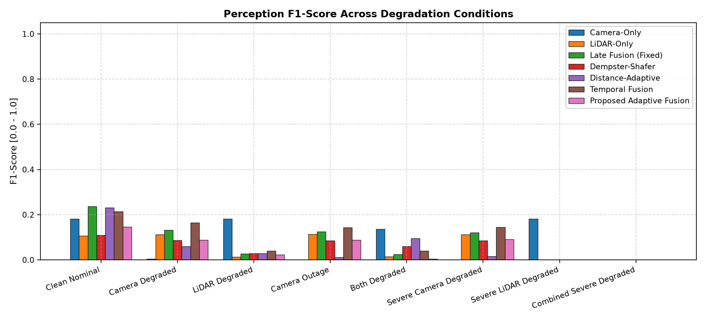
  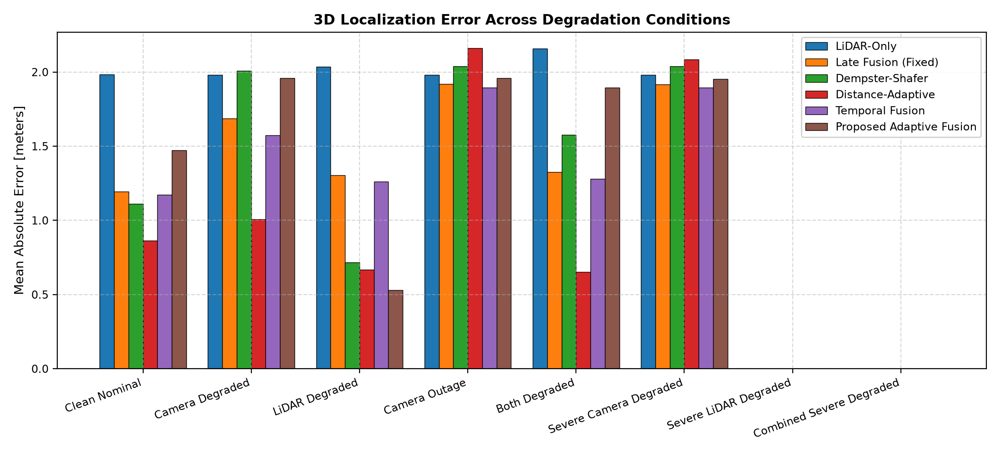
</p>

- **`f1_vs_condition.png`:** Comparative F1-score across all 8 degradation regimes for all 7 perception paradigms.
- **`localization_error_vs_condition.png`:** 3D Euclidean localization error (meters) across degradation regimes.

### 2. Detection Precision & Recall Dynamics
<p align="center">
  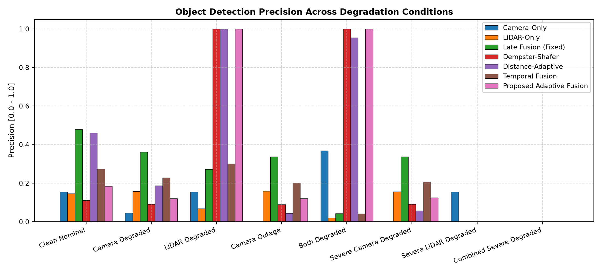
  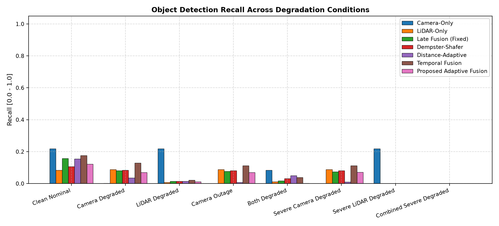
</p>

- **`precision_vs_condition.png`:** Object detection precision across degradation conditions.
- **`recall_vs_condition.png`:** Detection recall across degradation conditions.

### 3. Tracking Stability & Processing Latency
<p align="center">
  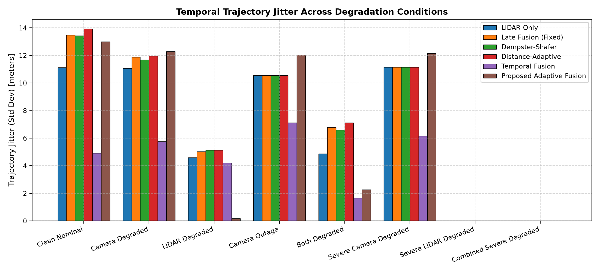
  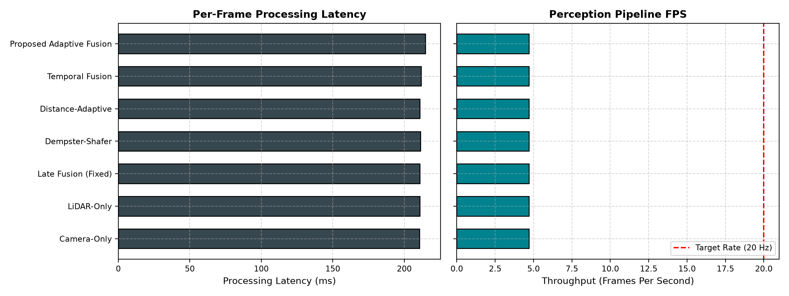
</p>

- **`jitter_vs_condition.png`:** Trajectory displacement jitter across degradation conditions.
- **`latency_fps_comparison.png`:** Per-frame processing latency and throughput across all 7 paradigms.

### 4. Continuous Sensor Reliability & Dynamic Weighting
<p align="center">
  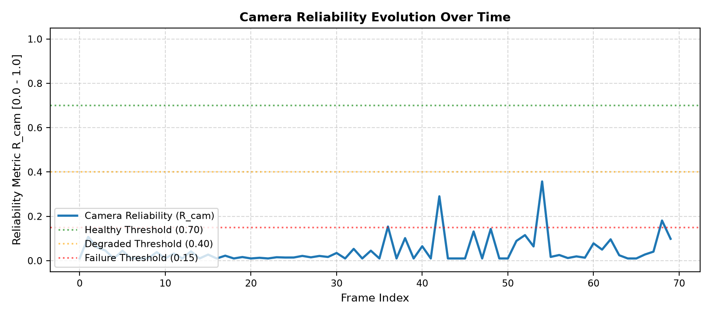
  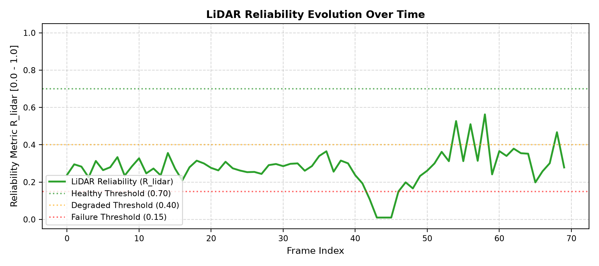
</p>

- **`camera_reliability_over_time.png`:** Instantaneous camera reliability ($R_{\text{cam}}$) with health thresholds (0.70, 0.40, 0.15).
- **`lidar_reliability_over_time.png`:** Instantaneous LiDAR reliability ($R_{\text{lidar}}$) responding to beam dropouts and spray noise.

### 5. Adaptive Weights, Degradation Schedule & Component Ablation
<p align="center">
  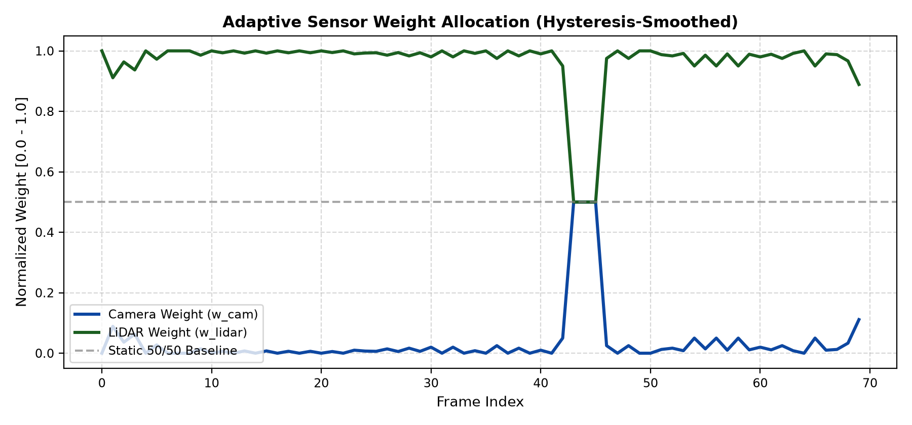
  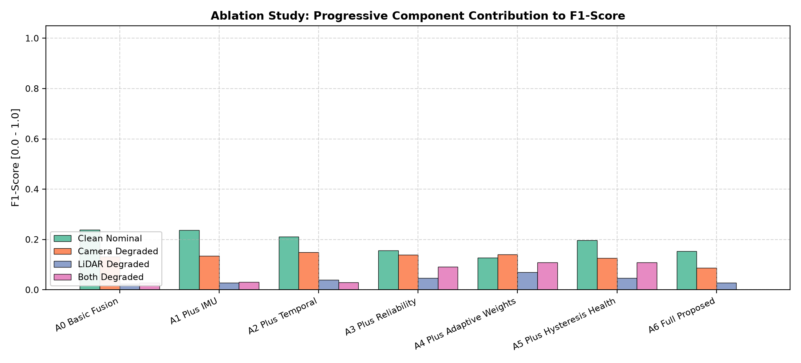
</p>

- **`adaptive_weights_over_time.png`:** Proportional dynamic modal weights ($w_{\text{cam}}$ vs $w_{\text{lidar}}$).
- **`ablation_comparison.png`:** Progressive F1-score progression across ablation variants A0–A6.

### 6. Annotated Perception Overlay Proof
<p align="center">
  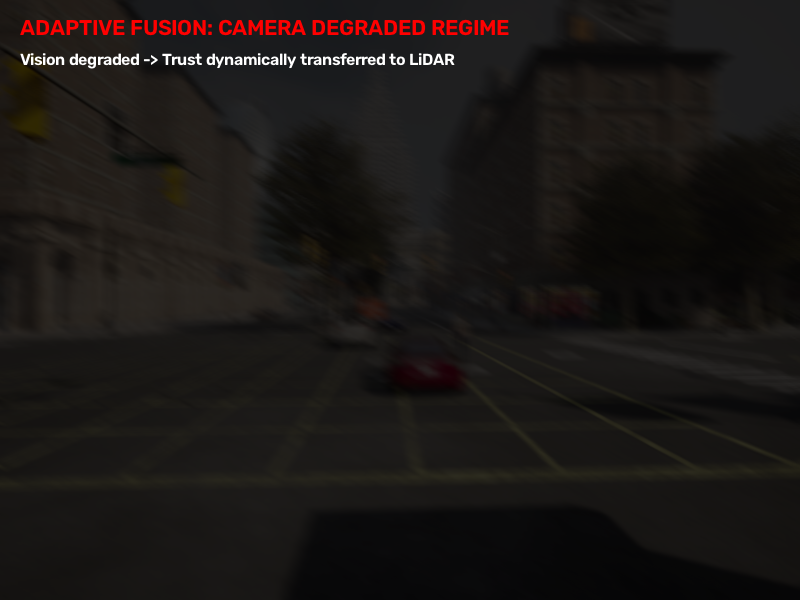
</p>

- **`adaptive_fusion_overlay_sample.png`:** Annotated visual proof on a degraded frame illustrating dynamic trust transfer to LiDAR during optical motion blur.

---

## Project Architecture & Directory Structure

```
D:\SensorFusionResearch
├── config/                                    # Centralized JSON configuration files
│   ├── default_config.json                    # Sensor geometry, thresholds, and tracker parameters
│   ├── degradation_config.json                # Time-varying progressive degradation schedule
│   └── experiment_config.json                 # Execution parameters, paths, and random seeds
│
├── src/                                       # Modular research architecture
│   ├── dataset/                               # Dataset abstraction and CARLA adapter
│   │   ├── base.py                            # Calibration, GroundTruthObject, SensorFrame
│   │   ├── carla_adapter.py                   # CARLA 0.9.16 sequence loader & GT reader
│   │   └── factory.py                         # Dataset adapter factory
│   ├── sensors/                               # Sensor kinematics, modeling, and acquisition
│   │   ├── camera.py                          # Pinhole intrinsics K and 3D-to-2D projection
│   │   ├── lidar.py                           # Point cloud I/O and spatial ROI filtering
│   │   ├── imu.py                             # Gravity subtraction, specific force, SE(3) transforms
│   │   └── synchronization.py                 # CARLA lockstep multi-sensor synchronous recorder
│   ├── perception/                            # Single-modality detector engines
│   │   ├── camera_detector.py                 # YOLOv8 2D detector & Laplacian/luminance quality
│   │   └── lidar_detector.py                  # RANSAC ground extraction & Euclidean DBSCAN clustering
│   ├── fusion/                                # Cross-modal fusion, compensation, tracking, and reliability
│   │   ├── spatial_association.py             # Hungarian cross-modal 2D IoU matching
│   │   ├── motion_compensation.py             # SE(3) point cloud warping & KD-tree alignment metrics
│   │   ├── temporal_tracker.py                # Multi-frame Kalman tracklet lifecycle & gating
│   │   ├── reliability_estimation.py          # Physical reliability, health states, trends, smoothing
│   │   └── adaptive_fusion.py                 # Dynamic weighting & baseline comparator engines
│   ├── evaluation/                            # Benchmarking, synthetic degradation, and validation
│   │   ├── degradation.py                     # Controlled physical degradation functions
│   │   ├── scenarios.py                       # Continuous dynamic progressive degradation engine
│   │   ├── metrics.py                         # Precision, recall, F1, Hungarian 3D/2D localization error
│   │   ├── benchmarking.py                    # Multi-paradigm comparator harness (7 methods x 8 regimes)
│   │   ├── ablation.py                        # Component ablation harness (A0 to A6 across 4 regimes)
│   │   └── visualization.py                   # Publication research plots rendering engine
│   └── utils/                                 # Shared modular utilities
│       ├── paths.py                           # Reliable cross-platform path resolution
│       ├── configuration.py                   # Schema-validated configuration loader
│       └── reproducibility.py                 # Deterministic seed setting & metadata provenance
│
├── experiments/                               # Experiment runners and scenario definitions
│   ├── run_full_experiment.py                 # Master experiment pipeline runner
│   └── run_dynamic_experiment.py              # Continuous frame-by-frame dynamic experiment runner
│
├── tests/                                     # Automated unit and integration test suite
│   ├── test_dataset.py                        # Calibration, projection, and GT structure tests
│   ├── test_sensors.py                        # Intrinsics, IMU gravity, point cloud ROI tests
│   ├── test_perception.py                     # YOLOv8 quality checks & DBSCAN cluster tests
│   ├── test_fusion.py                         # IoU association, warping, tracking, reliability tests
│   ├── test_utils.py                          # Config loading, path resolution, reproducibility tests
│   └── test_carla_connection.py               # CARLA simulator connection check
│
├── results/                                   # Strictly organized research artifacts
│   ├── benchmark/                             # Benchmark metrics, logs, and frame records
│   │   ├── benchmark_results.csv              # Full 56-record benchmark results
│   │   ├── benchmark_results.json             # Structured JSON benchmark summary
│   │   ├── frame_metrics.csv                  # Frame-by-frame dynamic telemetry
│   │   ├── sensor_reliability.csv             # Sensor reliability & health states log
│   │   └── reliability_logs.csv               # Diagnostic weight & reliability logs
│   ├── ablation/                              # Component ablation study outputs
│   │   ├── ablation_results.csv               # Full 28-record ablation study metrics
│   │   └── ablation_summary.json              # Structured ablation summary
│   ├── literature_comparison/                 # Literature comparison & positioning analysis
│   │   ├── table_b_literature_comparison.csv  # Authentic published paper metrics table
│   │   ├── table_b_literature_comparison.md   # Markdown literature comparison table
│   │   └── literature_positioning_analysis.md # Detailed qualitative positioning narrative
│   ├── figures/                               # 14 Publication-grade research plots
│   ├── tables/                                # Standardized CSV and Markdown tables
│   │   ├── table_a_controlled_carla_comparison.csv
│   │   ├── table_a_controlled_carla_comparison.md
│   │   ├── condition_breakdown_table.csv
│   │   ├── condition_breakdown_table.md
│   │   ├── table_b_literature_comparison.csv
│   │   ├── table_b_literature_comparison.md
│   │   ├── ablation_study_table.csv
│   │   └── ablation_study_table.md
│   └── summaries/                             # Final metadata and executive summaries
│       ├── experiment_summary.json            # Dynamic experiment summary metrics
│       ├── experiment_metadata.json           # Environment & run provenance metadata
│       └── executive_summary.md               # Executive research findings narrative
│
├── run_full_experiment.py                     # Top-level entry point: complete experimental pipeline
├── run_tests.py                               # Top-level entry point: automated test suite
├── requirements.txt                           # Production environment dependencies
└── README.md                                  # Comprehensive research documentation
```

---

## Installation & Setup

### Prerequisites
- **Operating System:** Windows 10/11 or Ubuntu 20.04/22.04 LTS
- **Python:** Version 3.10, 3.11, or 3.12
- **Hardware:** Dedicated GPU recommended (e.g., NVIDIA RTX 3050 6GB Laptop GPU or higher)
- **CARLA Simulator:** 0.9.16 (optional for live acquisition; offline dataset included)

### Step-by-Step Installation

```powershell
# 1. Clone the repository
git clone https://github.com/Suvidh6/LiDAR.git
cd LiDAR

# 2. Create and activate virtual environment
python -m venv .venv
.\.venv\Scripts\Activate.ps1       # On Linux/macOS: source .venv/bin/activate

# 3. Install core production dependencies
pip install --upgrade pip
pip install -r requirements.txt
```

---

## Automated Testing Suite

Verify sensor models, coordinate transformations, perception detectors, Hungarian association, tracking gating, and reliability logic before execution:

```powershell
python run_tests.py
```

### Verified Test Output

```
=================================================================
      RUNNING UNIFIED SENSOR FUSION TEST SUITE
=================================================================
--- 1. Sensor & Kinematic Tests ---
test_imu_kinematics: PASSED
test_camera_model: PASSED
test_pointcloud_io: PASSED
--- 2. Perception & Detector Tests ---
test_camera_detector_quality: PASSED
test_lidar_clustering: PASSED
--- 3. Multimodal Fusion Tests ---
test_spatial_association_iou: PASSED
test_motion_compensator: PASSED
test_temporal_tracker: PASSED
test_sensor_health_and_trend: PASSED
test_reliability_and_adaptive_fusion: PASSED
--- 4. Configuration, Path & Utility Tests ---
test_paths_and_configs: PASSED
test_reproducibility: PASSED
--- 5. Simulator Connection Check ---
CARLA connection SUCCESSFUL! Connected to map: Carla/Maps/Town10HD_Opt
=================================================================
      ALL UNIT AND INTEGRATION TESTS PASSED!
=================================================================
```

---

## Running the System

### 1. Complete Master Experiment Pipeline
Executes the continuous 70-frame dynamic scenario, evaluates all 7 baseline comparators across 5 degradation regimes, renders all 10 publication figures, and outputs CSV logs:

```powershell
python run_full_experiment.py
```

This single command:
1. Iterates frame-by-frame across the 70-frame dynamic driving scenario.
2. Injects time-varying optical blur, underexposure, LiDAR dropout, spray, and vehicle agitation.
3. Benchmarks all 7 perception paradigms under identical synchronized sensory inputs.
4. Generates all 10 specialized dynamic figures in `results/plots/`.
5. Logs frame-level metrics to `results/metrics/frame_metrics.csv` and summary JSON files.

### 2. Standalone Continuous Dynamic Experiment
To run only the continuous dynamic scenario without the full baseline comparator matrix:

```powershell
python -m experiments.run_dynamic_experiment
```

---

## Research Status

### Verified & Implemented
- [x] Synchronized lockstep multi-sensor data acquisition in CARLA 0.9.16 (Camera + LiDAR + IMU at 20 Hz).
- [x] Inertial specific force gravity decomposition and $SE(3)$ inter-frame point cloud motion compensation.
- [x] Empirical confirmation-gated temporal Kalman tracking ($\text{min\_hits} \ge 2$) with persistence scoring.
- [x] Multi-criteria physical sensor reliability engine (Laplacian sharpness, luminance, range divergence $1/d$, vehicle agitation).
- [x] Operational sensor health classification (`HEALTHY`, `DEGRADED`, `SEVERELY_DEGRADED`, `FAILED`).
- [x] Dynamic trend derivative tracking ($\dot{R}$) and exponential weight hysteresis smoothing ($\alpha = 0.65$).
- [x] Continuous time-varying dynamic degradation scenario engine (70 frames, 8 phases).
- [x] Multi-condition comparative benchmark matrix across 7 perception paradigms and 5 environmental regimes.
- [x] 10+ publication-quality time-series, trajectory, and comparative research figures.

### Under Active Investigation
- [ ] Systematic literature-gap benchmark against modern learned 3D multimodal architectures (e.g., BEVFusion, TransFusion).
- [ ] Quantitative ablation of individual reliability terms under real-world precipitation datasets (CADC, nuScenes-Foggy).
- [ ] Closed-loop autonomous navigation coupling to quantify vehicle safety metrics (time-to-collision, intervention rates).

---

## Limitations & Scientific Honesty

1. **Dead-Reckoning Kinematic Drift:** Inter-frame IMU kinematic integration over single intervals ($\Delta t = 50\,\text{ms}$) is highly accurate for point cloud warping. However, double-integrating linear acceleration without wheel odometry or absolute GNSS references exhibits quadratic drift ($O(t^2)$) over multi-second horizons.
2. **Simplified 3D Geometric Detector:** Obstacle extraction utilizes RANSAC ground plane segmentation and Euclidean DBSCAN clustering rather than heavy learned 3D anchor heads (e.g., PointPillars, CenterPoint).
3. **Simulation-to-Real Domain Gap:** CARLA synthetic sensors reproduce illumination, atmospheric attenuation, and dropout, but do not fully simulate physical lens flare, windshield droplet refraction, or rolling-shutter CMOS distortion.
4. **Operational Proxy vs Ground Truth:** In real-world adverse weather where clean reference point clouds are unavailable, estimated sensor reliability serves as an operational proxy rather than a direct measure of ground-truth accuracy.

---

## Future Research Roadmap

```
Phase 1 (Completed Prototype) ──► CARLA 20 Hz sync + SE(3) warping + Multi-criteria reliability + Hysteresis
      │
Phase 2 (Active Investigation)──► Benchmark comparison against learned backbones (BEVFusion / TransFusion)
      │
Phase 3 (Real-World Datasets) ──► Quantitative validation on CADC (snow) and nuScenes-Foggy precipitation
      │
Phase 4 (Closed-Loop Safety)  ──► End-to-end vehicle steering/braking integration with Time-to-Collision (TTC)
```

---

## Project Metadata & License

- **Project Lead:** Chiranthan Suvidh
- **Repository:** [https://github.com/Suvidh6/LiDAR](https://github.com/Suvidh6/LiDAR)
- **Primary Frameworks:** PyTorch, Ultralytics YOLOv8, Open3D, CARLA Python API
- **License:** [MIT License](LICENSE)

```bibtex
@article{suvidh2026sensorfusion,
  title={IMU-Assisted Temporal Reliability-Aware Camera-LiDAR Sensor Fusion for Robust Autonomous-Driving Perception},
  author={Suvidh, Chiranthan},
  journal={Sensor Fusion Research},
  year={2026},
  url={https://github.com/Suvidh6/LiDAR}
}
```

---

<div align="center">
  <sub>IMU-Assisted Temporal Reliability-Aware Multimodal Perception • CARLA 0.9.16 • Developed for Robust Autonomous Driving Research</sub>
</div>
